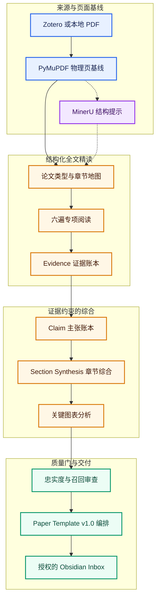

# LitAnchor 文锚

> Anchor every insight to the source.

[](https://github.com/xieyf1024/Litanchor-paper-reading/releases)
[](https://github.com/xieyf1024/Litanchor-paper-reading/actions/workflows/ci.yml)
[](docs/INSTALLATION_REQUIREMENTS.md)
[](LICENSE)

[English](README_EN.md) · [安装要求](docs/INSTALLATION_REQUIREMENTS.md) · [工作流](docs/WORKFLOW.md) · [评测](docs/EVALUATION.md) · [路线图](docs/ROADMAP.md)

LitAnchor 是一个面向研究生和科研工作者的轻量化、证据优先型学术精读 Skill。它从 Zotero 获取指定的单篇论文，只依据论文原文生成中文 Obsidian 笔记，并将重要主张锚定到 PDF 物理页、原文证据和 Zotero 跳转链接。

当前版本：**v0.6.0-beta.3 — Note Experience & Paper Template v1.0 Freeze**。它面向 Windows 上具备本地 Shell、文件和网络权限的 Agent；这是进入稳定版候选前的最后一个内容契约 Beta，不是支持所有 PDF 和所有聊天客户端的无人审核产品。

## 30 秒了解 LitAnchor

| 问题 | 答案 |
|---|---|
| 适合谁 | 需要把单篇英文论文沉淀为可追溯中文笔记的 Zotero + Obsidian 用户 |
| 输入什么 | Zotero 中的标题、DOI、citekey、Item Key，或本地 PDF；再指定目标 Vault |
| 得到什么 | 中文 Markdown、Evidence/Claim 侧车记录、验证报告，以及 0–3 个经过筛选的关键视觉对象 |
| 最强特点 | 每条重要论文事实回到原 PDF 物理页；另行审查“写错”与“漏写” |
| 不做什么 | 全文翻译、批量综述、外部背景补全、自动同行评审、静默覆盖既有笔记 |

## 两步使用

用户不需要逐字照抄下面的话。Agent 应按语义识别安装和精读意图。

```text
帮我安装这个 Skill：https://github.com/xieyf1024/Litanchor-paper-reading
```

```text
精读《论文标题》，把笔记保存到我的 Research Vault。
```

首次安装最多确认三项本机配置：Obsidian Vault、Literature Inbox，以及是否允许符合条件的 PDF 使用 MinerU。之后由 Agent 负责隔离环境、依赖、Zotero 定位、全文精读、质量校验和受限导出。

## 它与普通 AI 摘要有什么不同

| 普通摘要常见行为 | LitAnchor |
|---|---|
| 从全文生成一段流畅概括 | 先构建 Evidence → Claim → SectionSynthesis，再编排笔记 |
| 只检查已经写出的内容 | 分别检查忠实度和关键内容召回 |
| 页码未知时仍给出定位 | 未验证页码不得成为正式证据 |
| 容易忽略公式、指标和图表 | 单独处理方法、公式、实验和关键视觉对象 |
| 直接覆盖目标文件 | 只写授权目录，默认拒绝覆盖 |
| 把模型知识混入论文结论 | 论文事实只来自用户提供的原文 |

## 工作流



PyMuPDF 始终负责物理页码、原文引文、坐标和图片来源。MinerU 负责改善章节层级、阅读顺序、图题及复杂结构候选；它的内容只有重新对齐原始 PDF 页面后才能进入正式证据。

## 核心保证

- 只依据用户提供的论文原文；原文没有说明时明确标记。
- 不把讨论、解释、假设或推测升级成确定事实。
- 事实性主张在内部绑定 Evidence ID 和经过验证的 PDF 物理页；读者笔记只显示可点击的 `p.x` 定位。
- 保留数值、单位、变量、范围和适用条件。
- 解析失败和质量阻断必须显式报告。
- Zotero 默认只读；Obsidian 仅写入用户授权目录。
- 用户笔记默认不覆盖，外部上传必须服从本地 MinerU 授权策略。

## 环境要求

- Windows 10/11 x64；
- Python 3.10 或更高版本，当前 CI 覆盖 3.10–3.14；
- Zotero 7 或更高版本，已启用本机应用通信并具有本地 PDF 附件；
- Obsidian Desktop 和本地文件系统 Vault；
- 能执行本地命令、读写授权目录并下载依赖的 Agent。

Python 和 Zotero 只设最低版本，不设武断的最高版本；未覆盖的新版本由 `doctor` 进行能力探测并给出警告。完整说明见[安装要求](docs/INSTALLATION_REQUIREMENTS.md)。

## Agent 与开发接口

普通用户优先使用上面的自然语言入口。Agent 或贡献者可以调用：

```powershell
.\install.ps1 -Action Install
.\litanchor.ps1 doctor
.\litanchor.ps1 doctor -SupportBundle
.\litanchor.ps1 setup -Vault "Vault 名称" -Inbox "LitAnchor\00_Inbox" -MinerUConsent ask_each_time -CreateInbox
.\litanchor.ps1 run-plan -Paper "论文标题" -Vault "Vault 名称"
```

这些是 Agent 执行接口，不是要求普通用户手动完成的步骤。安装器只管理安装收据确认属于 LitAnchor 的文件，并支持修复、升级、回滚和确认式卸载。

公开反馈分为安装/生命周期、运行/PDF 和笔记质量三类。需要共享诊断时优先使用 `doctor -SupportBundle` 生成的脱敏 ZIP，并在上传前人工复核；不要附带论文、完整笔记、Zotero 数据或本机路径。

## 输出内容

LitAnchor 的三种模式不是单纯的长、中、短输出，而是三种不同的阅读契约：

| 模式 | 核心目的 | 正式输出内容 | 不强制生成 |
|---|---|---|---|
| `skim`（粗读） | 快速判断论文讲什么、是否值得继续读 | 只生成模板第 1 节：一句话摘要、论文类型、研究问题、方法骨架、主要结果、结论及其边界；保留必要来源定位 | 第 2–8 节 |
| `deep`（精读，默认） | 形成可审计的研究生级单篇精读笔记 | 生成第 1–6 节：背景与缺口、数据、方法、模型、公式/指标/参数、实验证据链、结果、关键图表、作者解释、结论边界和作者局限 | 第 7–8 节研究与学习层 |
| `internalize`（研究型阅读） | 在 deep 基础上把论文转化为可检验的研究行动 | 生成完整第 1–8 节：deep 的全部内容，外加研究联系、可证伪假设、相对原文增量、验证设计、失败条件、新颖性核查状态、术语/表达/追踪文献 | 未经核查的“创新”断言；模型补充的论文事实 |

三种模式共享“论文事实只来自原文”的硬规则。学习层使用 `[分析]`、`[假设]`、`[用户]` 标识；`internalize` 的研究想法不等于作者结论，也不自动等于领域创新。

当前读者笔记契约为 [**Paper Template v1.0**](skills/litanchor-paper-reading/assets/Paper%20Template.md)。笔记属性采用固定契约：只保留标题、第一作者、年份、期刊、DOI、论文类型、来源关键词、覆盖/定位/校验/审核状态、Skill/模板版本、日期和标签。阅读模式不再单列为属性，而是以 `skim`、`deep` 或 `internalize` 标签呈现；每篇笔记同时固定包含 `LitAnchor`，用户自定义标签不会被自动更新删除。

`deep` 模式默认覆盖：

- 论文问题、背景、研究空白和贡献；
- 数据、材料、预处理、方法和模型；
- 公式、评价指标、关键参数与实验设计；
- 核心结果、作者解释、证据允许推出的边界，以及作者明确说明的限制；
- 0–3 个关键视觉对象；有合格对象时直接嵌入原文图表，并说明正文小节、选择理由与 2–4 句图像解读；无合格对象时记录原因；
- 简洁的 `p.x` Zotero 页码链接和审查状态。

Evidence ID、Claim 映射与完整原文证据保存在私有侧车文件中；Markdown 正文只展示必要的可点击 `p.x` 定位，避免审计信息喧宾夺主。

## 当前评测状态

v0.6.0-beta.3 继承 beta.1/beta.2 已验证的 Windows Python 3.10–3.14 CI、冻结留出评测、病理 PDF/失败路径、MinerU 融合对比、隐私审计、生命周期恢复与确定性 Release 构建，并新增 Paper Template v1.0、模式裁剪、笔记属性、来源标签、实验证据链和结论边界的自动回归。评测论文只用于学习可复用的失败类型与工作流规则，不得把论文答案写入可分发 Skill。精确的 beta.3 发布门见[发布检查表](docs/release-checklist.md)。

- [v0.6 Public Beta 验证](evals/reports/v0.6-public-beta-validation.md)
- [MinerU 组件 A/B](evals/reports/v0.6-mineru-ab.md)
- [v0.6 评测指标](evals/v0.6-public-beta-metrics.json)
- [防测试集泄漏审计](docs/anti-leak-audit.md)

## 当前边界

- 一次处理一篇论文，不做批量综述或知识图谱。
- 以原生文本 PDF 为稳定路径；扫描件和异常版式可能降级或阻断。
- MinerU 是需要网络和用户授权的可选增强，不是正式证据来源。
- 不写回 Zotero，不提供双向同步，也不自动覆盖已有 Obsidian 笔记。
- 用户仍应复核关键图、引用定位和将要长期保存的最终笔记。

## 仓库结构

```text
.
├── .github/                         # CI、依赖更新与 Issue 模板
├── skills/litanchor-paper-reading/  # 可安装 Skill 及运行资源
├── docs/                            # 产品、工作流、架构与公开路线图
├── evals/                           # v0.6 评测清单、量表与公开报告
├── tests/                           # 自动化回归测试
├── tools/                           # 构建、验证、评测与发布审计
├── install.ps1                      # Windows 安装生命周期入口
├── litanchor.ps1                    # doctor、setup 与 run-plan
└── litanchor-install.json           # 机器可读安装契约
```

可安装 Skill 只包含运行所需的 `SKILL.md`、脚本、Schema、参考规则和模板。项目历史由 Git Tag、Release 和 [CHANGELOG](CHANGELOG.md) 保存，不在当前主分支重复堆放旧预览与开发记录。

## 文档与贡献

从[文档导航](docs/README.md)选择产品、工作流、Schema、集成、评测或隐私说明。提交问题或改进前请阅读[贡献指南](CONTRIBUTING.md)。

请勿提交论文 PDF、私人 Zotero 数据、Obsidian Vault、API 密钥、个人批注或运行时 Evidence/Claim 文件。

## License

[GNU Affero General Public License v3.0 only](LICENSE)。PyMuPDF 的许可路径、MinerU 外部服务边界和设计参考项目见 [THIRD_PARTY.md](THIRD_PARTY.md) 与 [NOTICE.md](NOTICE.md)。
