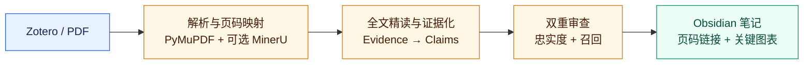

<div align="center">
  
  <h1>LitAnchor · 文锚</h1>
  <p><strong>Anchor every insight to the source.</strong></p>
  <p><code>LitAnchor = Literature + Anchor</code> —— 把每一条文献理解锚定到原文。</p>

  <p>
    <a href="https://github.com/xieyf1024/Litanchor-paper-reading/releases"></a>
    <a href="https://github.com/xieyf1024/Litanchor-paper-reading/actions/workflows/ci.yml"></a>
    <a href="docs/INSTALLATION_REQUIREMENTS.md"></a>
    <a href="https://agentskills.io"></a>
    <a href="LICENSE"></a>
  </p>

  <p>
    <a href="#两句话开始">快速开始</a> ·
    <a href="#为什么不只是-ai-摘要">为什么不同</a> ·
    <a href="#三种阅读方式">阅读模式</a> ·
    <a href="skills/litanchor-paper-reading/assets/Paper%20Template.md">笔记模板</a> ·
    <a href="docs/README.md">文档</a> ·
    <a href="README_EN.md">English</a>
  </p>
</div>

LitAnchor 是面向 Zotero + Obsidian 用户的证据优先型学术精读 Skill。给它一篇论文，它会依据原文完成结构化精读、核验重要主张与页码，并生成可直接沉淀到 Obsidian 的中文 Markdown 笔记。

## 两句话开始

把仓库链接交给具备本地文件和命令执行能力的 Agent：

```text
帮我安装这个 Skill：https://github.com/xieyf1024/Litanchor-paper-reading
```

安装完成后，直接说：

```text
精读《论文标题》，把笔记保存到我的 Research Vault。
```

不需要逐字照抄。Agent 应识别含义相近的安装、粗读、精读、内化和导出请求。首次使用最多确认 Obsidian Vault、Literature Inbox 和 MinerU 授权策略。

## 你会得到什么

| 📌 可追溯 | 🧠 完整精读 | 🖼️ 关键图表 | 🛡️ 安全沉淀 |
| :--- | :--- | :--- | :--- |
| 重要事实链接到经过核验的 PDF 物理页 | 方法、公式、实验、结果、讨论与限制分层整理 | 从原 PDF 筛选并裁取真正支持方法或结果的图表 | 只写授权目录，默认拒绝覆盖已有笔记 |

正式笔记保持清爽，只展示紧凑的 `p.x` Zotero 跳转链接；Evidence、Claim、完整引文和校验记录保存在私有侧车文件中。

## 为什么不只是 AI 摘要

| 常见摘要工具 | LitAnchor |
| :--- | :--- |
| 直接从全文生成流畅概括 | 先建立 Evidence → Claim → 章节综合，再写笔记 |
| 只检查已经写出的句子 | 分开检查“有没有写错”和“有没有漏掉重要内容” |
| 页码不确定也可能给出链接 | 未经原 PDF 核验的页码不能成为正式证据 |
| 容易略过公式、实验和图表 | 对方法、指标、实验链和视觉证据执行专项处理 |
| 用模型常识补全论文内容 | 论文事实只来自用户提供的原文 |

## 一眼看懂工作流



PyMuPDF 始终是物理页码、引文、坐标和原图裁剪的权威来源。符合条件且用户已授权时，MinerU 自动增强章节层级、阅读顺序、图题及复杂结构候选；其结果必须重新对齐原 PDF 后才能进入证据链。

## 三种阅读方式

| 模式 | 适合什么时候 | 输出重点 |
| :--- | :--- | :--- |
| `skim` 粗读 | 快速判断论文讲什么、是否值得继续读 | 一句话摘要、问题、方法骨架、主要结果、结论边界和必要定位 |
| `deep` 精读（默认） | 形成可审计的研究生级单篇笔记 | 背景与缺口、数据、方法、公式、实验、结果、图表、解释、限制与结论 |
| `internalize` 内化 | 把精读结果转化为可检验的研究行动 | deep 全部内容，加研究联系、可证伪假设、验证设计、失败条件与滚雪球阅读 |

三种模式都遵守同一事实边界。`internalize` 中的学习启发会标记为 `[分析]`、`[假设]` 或 `[用户]`，不会伪装成作者结论。完整结构见 [Paper Template v1.0](skills/litanchor-paper-reading/assets/Paper%20Template.md)。

## 安装与要求

当前公开版本优先支持 Windows 上具备本地 Shell、文件系统和网络权限的 Agent。用户只需提出安装请求，Agent 负责下载 Release、创建隔离环境、安装依赖、运行 `doctor` 并完成首次配置。

<details>
<summary><strong>环境要求与 Agent 接口</strong></summary>

- Windows 10/11 x64；
- Python 3.10 或更高版本；
- Zotero 7 或更高版本，已启用本机应用通信，并具有本地 PDF 附件；
- Obsidian Desktop 与本地文件系统 Vault；
- 可执行本地命令、读写授权目录并下载依赖的 Agent。

Python 和 Zotero 只设置最低版本。未覆盖的新版本由 `doctor` 进行能力探测，而不是被武断拒绝。

```powershell
.\install.ps1 -Action Install
.\litanchor.ps1 doctor
.\litanchor.ps1 setup -Vault "Vault 名称" -Inbox "LitAnchor\00_Inbox" -MinerUConsent ask_each_time -CreateInbox
.\litanchor.ps1 run-plan -Paper "论文标题" -Vault "Vault 名称"
```

这些是 Agent 和贡献者接口，不是普通用户必须手动执行的步骤。更多信息见[安装要求](docs/INSTALLATION_REQUIREMENTS.md)和[集成说明](docs/INTEGRATIONS.md)。
</details>

## 可靠性契约

- 只依据用户提供的论文原文；原文没有说明时明确标记。
- 不把讨论、解释、假设或推测升级为确定事实。
- 保留数值、单位、变量、范围、误差和适用条件。
- 解析失败、证据不足或内容召回不合格时阻止正式导出。
- Zotero 默认只读；Obsidian 只写用户授权的 Inbox。
- 外部解析必须服从本地授权；MinerU 永远不是正式证据来源。

## 当前边界

- 一次处理一篇论文，不做批量综述或知识图谱。
- 原生文本 PDF 是稳定路径；扫描件和异常版式可能降级或阻断。
- 不写回 Zotero，不做双向同步，也不静默覆盖已有笔记。
- 长期保存前仍建议人工复核关键图、核心数值和引用定位。

## 文档与贡献

[文档导航](docs/README.md) · [工作流](docs/WORKFLOW.md) · [数据结构](docs/DATA_SCHEMA.md) · [评测方法](docs/EVALUATION.md) · [路线图](docs/ROADMAP.md) · [贡献指南](CONTRIBUTING.md)

提交问题时请使用对应的安装、PDF 运行或笔记质量 Issue 模板。不要上传论文 PDF、私人 Zotero 数据、Obsidian Vault、API 密钥、个人批注或运行时 Evidence/Claim 文件。

## License

[GNU Affero General Public License v3.0 only](LICENSE)。PyMuPDF 许可路径、MinerU 服务边界和设计参考项目见 [THIRD_PARTY.md](THIRD_PARTY.md) 与 [NOTICE.md](NOTICE.md)。
