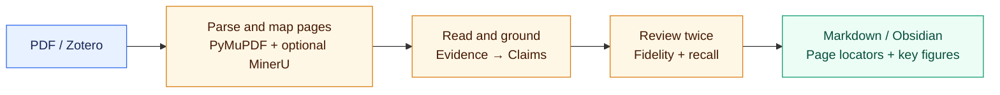

<div align="center">
  
  <h1>LitAnchor Notes</h1>
  <p><strong>Anchor every note to its source.</strong></p>
  <p><code>LitAnchor = Literature + Anchor</code> — start from the literature and keep every note anchored to its source.</p>

  <p>
    <a href="https://github.com/xieyf1024/Litanchor-paper-reading/releases"></a>
    <a href="https://github.com/xieyf1024/Litanchor-paper-reading/actions/workflows/ci.yml"></a>
    <a href="docs/INSTALLATION_REQUIREMENTS.md"></a>
    <a href="https://agentskills.io"></a>
    <a href="LICENSE"></a>
  </p>

  <p>
    <a href="#start-in-two-prompts">Quick start</a> ·
    <a href="#more-than-an-ai-summary">Why it is different</a> ·
    <a href="#three-reading-modes">Reading modes</a> ·
    <a href="skills/litanchor-paper-reading/assets/Paper%20Template.md">Note template</a> ·
    <a href="docs/README.md">Docs</a> ·
    <a href="README.md">中文</a>
  </p>
</div>

LitAnchor Notes is an evidence-first note brand. Its current public module, `litanchor-paper-reading`, handles one academic paper at a time. Give it a PDF for a standalone Markdown note, or use Zotero acquisition and safe Obsidian export.

## Start in two prompts

Give the repository URL to an agent that can run local commands and access files:

```text
Install this Skill for me: https://github.com/xieyf1024/Litanchor-paper-reading
```

Then provide a PDF directly:

```text
Deep-read this PDF and create a Markdown note next to it.
```

Or use the integrated Zotero → Obsidian route:

```text
Deep-read “Paper title” and save the note to my Research Vault.
```

The wording is not literal. Agents should recognize equivalent install, skim, deep-read, internalize, and export requests. The direct-PDF route needs neither Zotero nor Obsidian. The integrated route may confirm the Obsidian Vault, Literature Inbox, and MinerU consent policy on first use.

## What you get

| 📌 Traceable | 🧠 Complete | 🖼️ Visual | 🛡️ Safe |
| :--- | :--- | :--- | :--- |
| Important facts link to verified physical PDF pages | Methods, equations, experiments, results, discussion, and limitations stay distinct | Key method or result figures are selected and cropped from the original PDF | Writes stay inside an authorized directory and refuse overwrite by default |

Reader notes stay clean: they show compact linked `p.x` Zotero locators, while Evidence, Claims, full quotations, and validation records remain in private sidecars.

## More than an AI summary

| Generic summary tools | LitAnchor |
| :--- | :--- |
| Generate fluent prose directly from the document | Build Evidence → Claims → section synthesis before composing the note |
| Check only sentences already written | Review both factual fidelity and important-content recall |
| Emit page links even when locations are uncertain | Reject unverified PDF pages as formal evidence |
| Often skip equations, experiments, and figures | Run dedicated method, metric, experiment-chain, and visual passes |
| Fill gaps with model knowledge | Use the supplied paper as the only factual source |

## The workflow at a glance



PyMuPDF remains authoritative for physical pages, quotations, coordinates, and original-image crops. For eligible files with user consent, MinerU automatically improves heading structure, reading order, captions, and complex-layout candidates. Its output must align back to the original PDF before supporting evidence.

## Three reading modes

| Mode | Use it when | Main output |
| :--- | :--- | :--- |
| `skim` | You need a fast decision on what the paper says and whether to continue | One-sentence summary, question, method skeleton, main results, conclusion boundary, and essential locators |
| `deep` (default) | You need an auditable graduate-level paper note | Background/gap, data, methods, equations, experiments, results, visuals, interpretation, limitations, and conclusions |
| `internalize` | You want to turn reading into testable research action | Everything in deep, plus research connections, falsifiable hypotheses, validation design, failure conditions, and follow-up reading |

All modes share the same factual boundary. Learning-layer content in `internalize` is labelled `[analysis]`, `[hypothesis]`, or `[user]`; it never masquerades as an author conclusion. See [Paper Template v1.0](skills/litanchor-paper-reading/assets/Paper%20Template.md) for the complete structure.

## Installation and requirements

The current public build targets local-capable agents on Windows. The user asks for installation; the agent downloads the Release, creates an isolated environment, installs dependencies, runs `doctor`, and completes first-run setup.

<details>
<summary><strong>Environment requirements and agent entry points</strong></summary>

- Windows 10/11 x64;
- Python 3.10 or newer;
- Zotero 7 or newer (only for the Zotero integration route);
- Obsidian Desktop with a local Vault (only for Obsidian export);
- an agent that can run local commands, write to authorized paths, and download dependencies.

Python and Zotero use minimum versions only. Newer untested versions are capability-probed by `doctor` instead of being rejected by an arbitrary maximum.

```powershell
.\install.ps1 -Action Install
.\litanchor.ps1 doctor
.\litanchor.ps1 setup -Vault "Vault name" -Inbox "LitAnchor\00_Inbox" -MinerUConsent ask_each_time -CreateInbox
.\litanchor.ps1 run-plan -Paper "Paper title" -Vault "Vault name"
.\litanchor.ps1 run-plan -PdfPath "D:\Papers\paper.pdf" -OutputNote "D:\Notes\paper.md"
```

These are agent and contributor interfaces, not mandatory manual steps for end users. See [installation requirements](docs/INSTALLATION_REQUIREMENTS.md) and [integrations](docs/INTEGRATIONS.md).
</details>

## Reliability contract

- Use only the supplied paper for formal paper facts.
- Preserve author uncertainty; never upgrade interpretation or speculation to fact.
- Preserve numbers, units, variables, ranges, errors, and applicability conditions.
- Block formal export when parsing, evidence, or important-content recall fails.
- Keep Zotero read-only and Obsidian writes inside the authorized Inbox.
- Require local consent for external parsing; MinerU is never an authoritative evidence source.

## Current boundaries

- One paper per run; no batch review or knowledge graph.
- Native-text PDFs are the stable path; scanned and pathological layouts may degrade or block.
- Markdown is the sole formal note output; LitAnchor does not generate a separate PDF note.
- No Zotero write-back, bidirectional sync, or silent overwrite of existing notes.
- Review key visuals, core numbers, and source locators before long-term use.

## Documentation and contributing

[Documentation](docs/README.md) · [Workflow](docs/WORKFLOW.md) · [Data Schema](docs/DATA_SCHEMA.md) · [Evaluation](docs/EVALUATION.md) · [Roadmap](docs/ROADMAP.md) · [Contributing](CONTRIBUTING.md)

Use the matching installation, PDF runtime, or note-quality Issue form. Never upload paper PDFs, private Zotero data, Obsidian Vault contents, API keys, personal annotations, or runtime Evidence/Claim artifacts.

## License

[GNU Affero General Public License v3.0 only](LICENSE). See [THIRD_PARTY.md](THIRD_PARTY.md) and [NOTICE.md](NOTICE.md) for PyMuPDF licensing, MinerU service boundaries, and design references.
