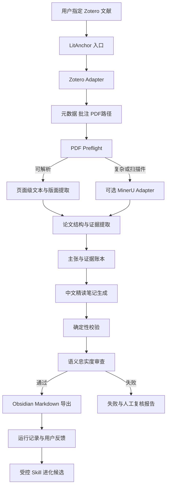
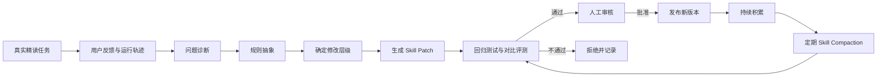

# LitAnchor 项目方案 v0.2

> **项目名称：LitAnchor**  
> 中文名：**文锚**  
> 仓库名建议：`litanchor`  
> Skill 名建议：`litanchor-paper-reading`  
> Slogan：**Anchor every insight to the source.**  
> 中文说明：**将每一条文献理解锚定到原文。**

GitHub 简介建议：

> A lightweight, evidence-grounded Zotero-to-Obsidian skill for close-reading academic papers.

发布前仍应检查 GitHub 组织名、PyPI 包名、域名和商标；当前名称先作为项目代号使用。

---

# 一、更新后的核心结论

## 1. LitAnchor 仍然应优先做成 Skill

Skill 适合封装可重复、有固定输入输出、需要稳定规则的工作流。官方建议复杂工作尽量拆成小型、可组合的 Skill，而不是制作一个无限扩张的大型 Agent。

LitAnchor 的固定任务是：

```text
指定 Zotero 文献
→ 获取 PDF、元数据和批注
→ 页面级解析
→ 证据约束的中文精读
→ 忠实度校验
→ 输出 Obsidian Markdown
```

它不需要：

- 自主搜索整个互联网；
    
- 自主决定长期科研方向；
    
- 无限循环规划；
    
- 自动修改用户全部知识库；
    
- 自由调用任意外部信息。
    

因此产品形态应为：

> **一个用户入口 Skill + 若干轻量脚本、模板和规则文件。**

不需要在 MVP 中构建开放式多智能体系统。

---

## 2. Chat、Work、Codex 不应被理解为三个可随意互相调用的函数

截至 2026 年 7 月，官方对三个工作面的定位是：

- **Chat**：快速问答、搜索、讨论和头脑风暴；
    
- **Work**：较长的多步骤研究、信息分析和成品交付；
    
- **Codex**：代码、命令、测试、仓库和技术工作。
    

官方文档没有明确说明：一个普通 Skill 可以在运行过程中自主创建 Chat、Work 和 Codex 会话并在三者之间传递上下文。

因此 LitAnchor v0.1 应采用：

> **按运行场景分工，而不是假设 Skill 可以自动跨模式派生任务。**

未来若 ChatGPT 提供正式的跨模式委派接口，再升级为自动路由。

---

## 3. 推荐的工具分工

### Work：默认用户入口

适合执行：

- “精读 Zotero 中的某篇文献”；
    
- 完成长流程；
    
- 管理多阶段产物；
    
- 生成最终 Markdown；
    
- 汇总警告和校验结果；
    
- 在用户允许时访问本地文件和桌面应用。
    

Work 桌面端在获得权限后可以使用本地文件和桌面应用；网页版和移动端 Work 不能直接访问电脑本地文件。

**推荐命令：**

```text
使用 LitAnchor 精读 Zotero 中的「论文标题或 citekey」，
按深度模式分析并写入 Obsidian。
```

### Chat：互动理解和追问

适合执行：

- 解释某个公式或方法；
    
- 讨论某张图；
    
- 对已经生成的笔记继续提问；
    
- 将复杂术语解释得更简单；
    
- 用户人工复核某条结论；
    
- 围绕论文进行研究生级教学。
    

Chat 不负责：

- 管理仓库文件；
    
- 执行大量脚本；
    
- 自动写入多个本地文件；
    
- 维护测试和版本。
    

### Codex：工程实现和确定性工作

适合执行：

- 创建和维护 LitAnchor 仓库；
    
- 编写 Zotero、PDF 和 Obsidian 适配脚本；
    
- 执行测试；
    
- 运行格式、数值和证据校验；
    
- 修改 Skill；
    
- 生成候选进化补丁；
    
- 管理 Git 版本和回滚；
    
- 排查失败工作流。
    

### 推荐运行策略

|场景|推荐入口|
|---|---|
|首次创建项目|Codex|
|日常单篇精读|Work 桌面端|
|Work 暂不可用|Codex 桌面端|
|对结果进行追问|Chat|
|调试 Zotero 或 Obsidian|Codex|
|优化 Skill|Codex|
|批量处理|后续版本的 Work 或 Codex|

---

# 二、产品定义

## 1. 产品定位

LitAnchor 是：

> 面向研究生的轻量化、证据优先型学术精读 Skill。它从 Zotero 获取指定论文，以用户提供的论文原文为唯一事实来源，经过固定的精读、证据绑定和校验流程，最终生成可直接进入 Obsidian 的中文 Markdown 笔记。

## 2. 核心用户

- 研究生新生；
    
- 阅读全英文论文的大学生；
    
- 跨专业科研学习者；
    
- 使用 Zotero 与 Obsidian 的研究人员。
    

## 3. 核心价值

LitAnchor 不只是“把论文总结得更短”，而是：

1. 减少精读和整理时间；
    
2. 保留方法、公式、图表和适用条件；
    
3. 区分作者结果、解释、假设与推测；
    
4. 让重要主张可以回到原文页码；
    
5. 将结果转化为长期可维护的 Obsidian 笔记；
    
6. 在无法可靠处理时明确失败，而不是生成看似完整的内容。
    

## 4. 核心原则

优先级固定为：

```text
忠实性
> 可追溯性
> 关键信息完整性
> 结构清晰度
> 阅读效率
> 表达流畅度
```

当“完整”与“可靠”冲突时，必须选择可靠。

---

# 三、轻量化架构

## 1. 设计目标

核心版本必须做到：

- 不部署数据库；
    
- 不建立向量库；
    
- 不下载嵌入模型；
    
- 不运行长期后台服务；
    
- 不建立 HTML 仪表盘；
    
- 不批量同步整个 Zotero 库；
    
- 不复制一个完整 Obsidian 插件；
    
- 不默认安装 MinerU；
    
- 不把所有功能塞进一个巨大提示词。
    

## 2. 推荐架构



## 3. 一个入口，三个内部层

### A. 获取层

负责：

- 查找 Zotero 条目；
    
- 获取元数据；
    
- 获取附件 Key；
    
- 获取 PDF；
    
- 获取 Zotero 批注；
    
- 保留原始语言；
    
- 不做翻译和总结。
    

### B. 理解层

负责：

- 识别论文类型；
    
- 识别结构；
    
- 提取证据；
    
- 分析方法、结果、图表、公式和限制；
    
- 生成主张账本；
    
- 生成中文笔记。
    

### C. 工程层

负责：

- Schema 校验；
    
- 页码校验；
    
- 数值校验；
    
- Markdown 校验；
    
- 文件安全写入；
    
- 运行日志；
    
- 测试和 Skill 进化。
    

---

# 四、Zotero—ChatGPT—Obsidian 连接方案

## 1. 推荐的 Zotero 接入：Zotero MCP 核心版

`zotero-mcp` 已提供：

- 按标题、作者和内容搜索；
    
- 元数据读取；
    
- 全文读取；
    
- Zotero 原生批注读取；
    
- Better BibTeX citekey 查询；
    
- 本地、Web API 和混合模式；
    
- 面向 ChatGPT 等 MCP 客户端的接口。
    

其基础安装不包含语义搜索和大型机器学习依赖；向量检索、PDF 扩展和 Scite 功能被拆成可选 extras。

许可证为 MIT，允许在保留版权和许可声明的前提下使用、修改和分发。

### MVP 使用范围

只启用：

- 搜索；
    
- 元数据；
    
- 全文；
    
- 批注；
    
- 附件定位。
    

默认不启用：

- `semantic`；
    
- ChromaDB；
    
- embedding；
    
- Scite；
    
- 自动添加论文；
    
- 修改 Zotero 元数据；
    
- 批量标签操作。
    

### 推荐权限

MVP 默认：

```text
Zotero：只读
Obsidian：仅写入指定 Literature Inbox
```

不允许 Skill 删除或修改 Zotero 条目。

## 2. ChatGPT MCP 的现实限制

ChatGPT 自定义 MCP 的计划、工作区和写入能力存在差异；本地 MCP 服务器也不能由 ChatGPT 网页端直接连接，可能需要 Secure MCP Tunnel。完整写入能力目前主要面向 Business、Enterprise 和 Edu，Pro 的可用范围更有限。

因此必须同时保留两个接入模式。

### 模式 A：本地 Codex / Work 桌面端

```text
Zotero Local API 或 Zotero MCP
→ LitAnchor
→ 本地 Obsidian Vault
```

这是 MVP 推荐模式。

### 模式 B：ChatGPT Web / 云端

```text
远程 MCP 或手动上传 PDF
→ LitAnchor
→ 下载 Markdown
→ 用户放入 Obsidian
```

不把云端直接访问本地 Zotero 和 Vault 作为 MVP 的前置条件。

## 3. Zotero 备用适配器

如果 `zotero-mcp` 无法在用户环境中稳定使用，则编写一个薄适配器：

```text
scripts/zotero_adapter.py
```

优先级：

1. 已连接的 Zotero MCP；
    
2. Zotero 7 Local API；
    
3. Zotero Web API 只读；
    
4. 用户手动上传 PDF。
    

不建议 MVP 直接读取 `zotero.sqlite`：

- 容易遇到文件锁；
    
- 与 Zotero 内部 Schema 耦合；
    
- 路径和版本差异较大；
    
- 不利于开源用户安装。
    

---

# 五、Obsidian 输出策略

## 1. MVP 不开发 Obsidian 插件

输出本质上只是：

```text
Markdown 文件
+ YAML Frontmatter
+ Zotero 页面链接
+ 隐藏的证据侧车 JSON
```

将 Markdown 写入用户配置的目录即可。

推荐默认目录：

```text
<Obsidian Vault>/00 Inbox/Literature/
```

用户后续可自行移动到正式知识库。

## 2. 文件写入规则

### 新文件

无重名时可以直接写入。

### 已存在文件

不得自动覆盖。

生成：

```text
论文标题.candidate.md
论文标题.diff.md
```

由用户确认后再替换。

### 写入流程

```text
生成临时文件
→ Markdown 校验
→ 文件名校验
→ 检查重名
→ 原子性重命名
```

## 3. Zotero 链接

附件 Key 可用时，输出：

```text
zotero://open-pdf/library/items/<attachmentKey>?page=<page>
```

这样用户可以从 Obsidian 直接跳回证据页。

---

# 六、参考仓库的借鉴结论

## 1. Zotero Analytical Workflow Skills

该仓库将工作流拆成：

1. 分类和任务管理；
    
2. Zotero 数据获取；
    
3. 中文分析和 Obsidian 写入。
    

数据获取阶段明确要求保持原始语言，不在抽取阶段翻译或总结。

### 借鉴

- 获取、分析、写入分层；
    
- 原始语料缓冲区；
    
- Item Key 和附件 Key；
    
- 公式乱码阻断；
    
- Zotero PDF 页面链接；
    
- 失败时宁缺毋滥。
    

其公式规则明确提出：残缺公式不得强行输出，也不得为残缺符号编造变量解释。

### 不直接照搬

- 不采用“批注足够就跳过全文”；
    
- 不采用硬编码 Windows 路径；
    
- 不在 MVP 中刷新多个 Dataview 索引；
    
- 不直接复制模板和 Skill，除非进一步核实许可；
    
- 不把全文精读和批处理放在同一入口。
    

---

## 2. Obsidian Zotero Integration

该插件可以把 Zotero 的引用、参考文献、笔记和 PDF 批注导入 Obsidian，并依赖 Better BibTeX。

### 借鉴

- Frontmatter 字段设计；
    
- citekey；
    
- Zotero 跳转链接；
    
- 模板变量；
    
- 批注格式；
    
- 与 Better BibTeX 的兼容思路。
    

### 不作为核心依赖

其许可证是 GPLv3。若直接复制或修改代码并分发，需要遵守 GPLv3 对衍生作品和源码发布的要求。

LitAnchor MVP 只保证输出兼容，不集成或复制其代码。

---

## 3. Zotero Bridge

该插件通过 Zotero 7 Local API 为其他 Obsidian 插件提供 Zotero 接口，并输出适合模板使用的 Key、作者、日期和标题等字段。

### 借鉴

- Zotero Local API 抽象；
    
- `libraryUri`；
    
- `item key`；
    
- 模板友好的标准元数据对象；
    
- 搜索后返回唯一对象。
    

### 不作为 MVP 依赖

它主要是供其他 Obsidian 插件使用的桥接层。LitAnchor 只写 Markdown，不需要先开发 Obsidian 插件。

---

## 4. Zotero MCP

### 推荐用途

作为 LitAnchor 的首选 Zotero 数据接口。

### 采用内容

- 搜索；
    
- 元数据；
    
- 批注；
    
- 全文；
    
- Local API；
    
- citekey；
    
- 只读模式。
    

### 暂不采用

- 向量检索；
    
- 自动同步数据库；
    
- Zotero 写入；
    
- Scite；
    
- 自动添加 DOI；
    
- 重复文献合并。
    

---

## 5. Paper Notes

该项目采用 evidence-first 流程：PDF 文本提取失败时阻止完整笔记生成，并将 manifest、summary、sections、annotations 和用户编辑分别保存。

其 Skill 还明确规定：

- 用户数据只写入指定输出目录；
    
- 无隐藏遥测；
    
- 运行状态保存在项目输出中；
    
- 文本抽取不足时停止生成；
    
- 用户编辑优先于后续自动生成内容。
    

许可证为 MIT。

### 借鉴

- 提取失败即阻断；
    
- 运行产物分离；
    
- 用户修改优先；
    
- 论文类型自适应；
    
- `evidence_map` 和 `uncertainties`；
    
- 结果、解释和假设分层；
    
- 原始 Markdown 与渲染结果分离。
    

### 不采用

- HTML 阅读页面；
    
- 阅读热力图；
    
- 浏览器 LocalStorage；
    
- 主题颜色系统；
    
- 独立 Dashboard；
    
- 将所有图片仅供人工查看、完全禁止模型分析图片。
    

LitAnchor 的核心目标包含重要图表，因此会对少量关键页面进行选择性视觉分析。

---

## 6. MinerU

MinerU 可以将 PDF 和其他文档转换为 Markdown、JSON 等机器可读格式，并支持多栏布局、图像、表格、公式、扫描件检测和 OCR。

### 定位

仅作为：

> **复杂 PDF 解析失败后的可选适配器。**

### 触发条件

- 扫描型论文；
    
- 双栏顺序严重错误；
    
- 大量公式；
    
- 跨页表格；
    
- 原生提取乱码；
    
- 图表无法定位。
    

### 不作为默认依赖

原因：

- 安装和模型体积更大；
    
- 维护复杂；
    
- 超出轻量 MVP 需求；
    
- 绝大多数原生学术 PDF 可先用 PyMuPDF 处理。
    

MinerU 采用基于 Apache 2.0 并附带额外条件的自定义许可；对外在线服务还涉及显著标识义务。

---

# 七、对用户现有阅读方法和模板的吸收

用户提供的模板包含：

- 文章骨架；
    
- Introduction 的背景、问题和创新点；
    
- Materials and Methods；
    
- Results and Discussion；
    
- 重要图表；
    
- Conclusion；
    
- 125 原则；
    
- 问题、引用和滚雪球。
    

用户的阅读入门笔记还包含：

- 精读和泛读区分；
    
- 不同阅读目标；
    
- 推荐阅读顺序；
    
- 三遍阅读法；
    
- 研究思路、方法、图表与写作表达的学习。
    

这些内容将转化为 LitAnchor 的三种运行模式。

## 1. `skim`：速读

输出：

- 一句话总结；
    
- 标题判断；
    
- 摘要四要素；
    
- 论文结构；
    
- 核心科学问题；
    
- 方法概览；
    
- 主要结论；
    
- 是否值得继续精读。
    

## 2. `deep`：精读

默认模式。

输出完整：

- 背景；
    
- 空白；
    
- 数据；
    
- 方法；
    
- 指标；
    
- 公式；
    
- 图表；
    
- 结果；
    
- 讨论；
    
- 局限性；
    
- 结论；
    
- 证据索引。
    

## 3. `internalize`：内化

在 `deep` 基础上增加：

- 125 原则；
    
- 研究设计可借鉴点；
    
- 文章结构；
    
- 可学习句式；
    
- 待解决术语；
    
- 可引用片段；
    
- 滚雪球参考文献；
    
- 用户反思区域。
    

## 4. 原文事实与学习启发分层

笔记必须明确区分：

### 原文层

只能写论文直接支持的内容。

### 分析层

对论文逻辑和证据的受约束解释。

### 学习层

包括：

- 可借鉴思路；
    
- 125 原则中的“1 个思路”；
    
- 与用户研究的潜在联系；
    
- 后续问题。
    

所有学习层内容都必须标记：

```text
以下属于学习启发，不是作者原文结论。
```

---

# 八、更新后的端到端工作流

## 阶段 1：解析用户请求

支持：

```text
精读论文标题
精读 @citekey
精读 Zotero Item Key
精读当前选中的文献
泛读论文标题
用内化模式精读论文标题
```

生成：

```yaml
reading_mode: skim | deep | internalize
source_query: string
output_language: zh-CN
external_knowledge: false
```

## 阶段 2：Zotero 查找

匹配优先级：

1. Item Key；
    
2. Better BibTeX citekey；
    
3. DOI；
    
4. 完整标题；
    
5. 模糊标题。
    

只有多个高相似候选无法区分时，才要求用户选择。

不得仅凭第一个搜索结果直接精读。

## 阶段 3：获取 SourceBundle

包括：

- 元数据；
    
- PDF 附件；
    
- 附件 Key；
    
- 批注；
    
- Zotero 笔记；
    
- PDF 本地路径或下载内容；
    
- 文件哈希；
    
- 来源方式。
    

## 阶段 4：PDF 预检

检查：

- 文件有效性；
    
- 加密；
    
- 页数；
    
- 文本覆盖率；
    
- 扫描件；
    
- 乱码；
    
- 双栏；
    
- 页面顺序；
    
- 公式和表格密度。
    

输出：

```text
PASS
PASS_WITH_WARNINGS
FALLBACK_REQUIRED
BLOCKED
```

## 阶段 5：页面级提取

MVP 默认使用 PyMuPDF：

- 按页提取文本；
    
- 保存页面边界；
    
- 保存文本块坐标；
    
- 提取目录；
    
- 检测图表和公式引用；
    
- 按需渲染关键页。
    

不得将全文直接拼接成一个没有页码的字符串。

## 阶段 6：三遍式分析

### 第一遍：论文骨架

阅读：

- 标题；
    
- 摘要；
    
- 章节标题；
    
- 结论；
    
- Introduction 最后部分。
    

输出：

- 论文类型；
    
- 核心问题；
    
- 方法概览；
    
- 主要贡献；
    
- 结构地图。
    

### 第二遍：分章节证据提取

提取：

- 背景；
    
- 前人研究；
    
- 研究空白；
    
- 假设；
    
- 数据；
    
- 方法步骤；
    
- 参数；
    
- 指标；
    
- 结果；
    
- 讨论；
    
- 局限性；
    
- 结论。
    

### 第三遍：结构重构

建立：

```text
问题
→ 为什么重要
→ 前人不足
→ 作者怎么做
→ 用什么证据判断
→ 得到什么结果
→ 作者如何解释
→ 有什么限制
```

## 阶段 7：图表和公式专项分析

只处理：

- 正文反复引用的图表；
    
- 支撑核心结果的图表；
    
- 方法流程图；
    
- 关键公式；
    
- 关键指标定义。
    

不对所有装饰性图片逐一分析。

每个对象记录：

- 编号；
    
- 页码；
    
- 标题；
    
- 用途；
    
- 支持的主张；
    
- 解析状态；
    
- 是否需要人工复核。
    

## 阶段 8：证据与主张账本

事实性内容必须先进入主张账本，再生成 Markdown。

```yaml
claim_id: C-001
text_zh: string
claim_type: result
epistemic_status: observed
evidence_ids:
  - E-023
page_refs:
  - 12
numeric_items: []
validation_status: pending
```

## 阶段 9：笔记生成

笔记生成器只读取：

- 结构地图；
    
- 证据单元；
    
- 主张账本；
    
- 图表公式记录；
    
- 用户配置。
    

不再自由读取完整全文并随意发挥。

## 阶段 10：双重校验

### Codex / 脚本校验

- Schema；
    
- 引用；
    
- 页码；
    
- 原文片段；
    
- 数值；
    
- 单位；
    
- 变量；
    
- Markdown；
    
- YAML；
    
- 文件名；
    
- 重名。
    

### 模型语义校验

- 是否过度概括；
    
- 是否增强作者语气；
    
- 是否将相关写成因果；
    
- 是否扩大适用范围；
    
- 是否混淆前人观点；
    
- 是否将讨论写成结果；
    
- 是否遗漏重要条件。
    

## 阶段 11：Obsidian 导出

通过后输出：

```text
论文标题.md
.litanchor/<paper-id>/evidence.json
.litanchor/<paper-id>/validation.json
.litanchor/<paper-id>/run.json
```

## 阶段 12：用户反馈

用户可以说：

```text
这条结论不准确
第 8 页的公式解析错了
以后不要把讨论写成结论
这个模板字段太多
保留我手动修改的内容
```

反馈只进入反馈日志，不立即修改正式 Skill。

---

# 九、Markdown 模板 v0.2

```markdown
---
title:
authors:
year:
journal:
doi:
citekey:
zotero_item_key:
zotero_attachment_key:
source_file:
document_hash:
paper_type:
reading_mode:
skill_version:
template_version:
validation_status:
created:
tags:
  - literature-note
---

# 论文标题

## 0. 阅读状态

- 精读模式：
- PDF 解析状态：
- 校验状态：
- 建议人工复核页：

## 1. 文章骨架

### 一句话总结

### 标题判断

- 研究对象：
- 研究问题：
- 研究方法：

### 摘要四要素

- 目的：
- 方法：
- 结果：
- 结论：

### 文章结构

## 2. 核心科学问题

## 3. 研究背景、前人研究与研究空白

## 4. 研究对象、数据与材料

## 5. 方法流程

### 方法概述

### 具体步骤

### 模型、算法与对比实验

### 评价指标

## 6. 重要公式与变量

## 7. 核心结果

## 8. 作者的解释与讨论

## 9. 重要图表

| 图表 | 页码 | 说明什么 | 支持什么结论 | 解析状态 |
|---|---:|---|---|---|

## 10. 局限性、不确定性与适用边界

## 11. 结论

## 12. 术语与背景知识

## 13. 125 学习法

> 以下属于学习启发，不是作者原文结论。

### 1 个可继续思考的思路

### 2 个值得模仿的图表

### 5 个值得学习的英文表达

## 14. 问题、引用与滚雪球

### 不懂的术语与问题

### 可能引用的内容

### 值得继续追踪的参考文献

## 15. 我的思考

> 本区域保留用户手动编辑，自动更新时不得覆盖。

## 16. 证据索引

## 17. 校验信息
```

---

# 十、核心数据结构

## 1. ExecutionPlan

```yaml
task_id: string
preferred_surface: work | codex | chat
reading_mode: skim | deep | internalize
source_query: string
external_knowledge_allowed: false
write_to_obsidian: boolean
overwrite_policy: block
```

## 2. SourceBundle

```yaml
paper_id: string
zotero_item_key: string
attachment_key: string
metadata: {}
annotations: []
pdf:
  path: string
  hash: string
  page_count: integer
  extraction_status: string
pages: []
```

## 3. EvidenceUnit

```yaml
evidence_id: string
type: string
page_index: integer
printed_page: string | null
section: string
quote_original: string
bounding_box: array | null
contains_number: boolean
contains_unit: boolean
epistemic_markers: []
confidence: number
needs_review: boolean
```

## 4. ClaimRecord

```yaml
claim_id: string
text_zh: string
type: string
epistemic_status: observed | supported | interpreted | hypothesized | speculative
evidence_ids: []
page_refs: []
numbers: []
validation:
  traceable: boolean
  semantic_support: pass | warning | fail
  numeric_fidelity: pass | warning | fail
  modality_fidelity: pass | warning | fail
```

## 5. FeedbackEvent

```yaml
feedback_id: string
run_id: string
paper_id: string
category: extraction | evidence | reasoning | format | integration
user_message: string
affected_claims: []
confirmed_error: boolean | null
proposed_rule: string | null
status: recorded | reviewed | promoted | rejected
```

## 6. EvolutionCandidate

```yaml
candidate_id: string
base_version: string
source_feedback_ids: []
target_problem: string
patch_summary: string
changed_files: []
evaluation_before: {}
evaluation_after: {}
regressions: []
status: proposed | tested | approved | rejected
```

---

# 十一、提示词层、校验层和导出层

## 1. 提示词层

不要使用一个巨型 Prompt。

拆成：

1. `paper_profile.md`
    
2. `structure_extraction.md`
    
3. `evidence_extraction.md`
    
4. `figure_equation_analysis.md`
    
5. `claim_builder.md`
    
6. `note_composer.md`
    
7. `semantic_reviewer.md`
    

所有提示词共享硬规则：

```text
只依据提供的论文原文。
没有证据时写“原文未说明”。
无法解析时报告解析失败。
不得使用模型自身知识补充。
不得把作者推测改为确定事实。
事实性内容必须绑定 Evidence ID。
保留数值、单位、变量、范围和条件。
```

## 2. 规则校验层

尽量由代码完成：

- Evidence ID 存在性；
    
- 页码范围；
    
- 原文字符串定位；
    
- 数值和单位对比；
    
- YAML；
    
- Markdown；
    
- 必需章节；
    
- 文件覆盖；
    
- 占位符；
    
- 重复主张。
    

语义模型只负责代码难以判断的问题。

## 3. 导出层

Markdown Renderer 不重新理解论文，只负责：

- 模板映射；
    
- Evidence Callout；
    
- Zotero 链接；
    
- Frontmatter；
    
- 文件名；
    
- 临时写入；
    
- 原子保存。
    

---

# 十二、受控自进化机制 v0.3

## 12.1 自进化的定义

LitAnchor 的“自进化”不是模型自行训练，也不是每次收到反馈后直接修改正式 `SKILL.md`。

它是：

> 将真实文献精读任务中的用户反馈和运行失败记录为证据，抽象为可复用规则，写入正确的 Skill 层级，经过自动评测和人工审核后，形成可发布、可回滚的新版本。

完整闭环为：


---

## 12.2 LitAnchor 的三层结构

## 第一层：路由层

职责：

- 让 ChatGPT 判断何时应该调用 LitAnchor；
- 判断用户需要速读、精读还是内化；
- 判断用户是在指定论文、追问论文，还是修改已有笔记；
- 判断输入来自 Zotero、PDF 或已有 Obsidian 笔记。

主要内容：

```
name: litanchor
description: ...
```

以及 Skill 的适用场景和触发边界。

### 路由层适合解决的问题

- 用户说“分析这篇论文”，但 Skill 没有被触发；
- 用户只想解释一个术语，却错误启动了整篇精读；
- 用户说“精读论文标题”，却匹配到了错误的 Zotero 条目；
- `skim`、`deep`、`internalize` 模式选择错误；
- 用户在追问已有笔记时，系统重新处理整篇 PDF。

### 路由层可进化内容

- `description`；
- 触发关键词；
- 不触发条件；
- 输入识别规则；
- 阅读模式判定；
- 条目匹配规则；
- 调用路径。

---

## 第二层：指令层

主要对应：

```
SKILL.md
```

职责：

- 定义端到端工作流；
- 定义判断标准；
- 定义工具调用顺序；
- 定义可靠性规则；
- 定义输出契约；
- 定义失败与重试策略。

### 指令层适合解决的问题

- 把 Discussion 中的推测写成确定事实；
- 遗漏方法步骤；
- 先生成总结，再找证据；
- 数值和单位没有保留；
- 图表分析与正文不一致；
- 笔记写入前没有校验；
- 原文未说明时模型进行了补充；
- 输出结构重复或顺序混乱。

### 指令层可进化区域

#### Workflow

例如原流程：

```
提取全文
→ 生成笔记
```

根据失败反馈，可改为：

```
结构识别
→ 分章节证据提取
→ 图表公式专项处理
→ 主张账本
→ 笔记生成
→ 忠实度校验
```

#### Quality Checks

例如新增：

```
## Quality checks

在生成正式笔记前检查：

- 每条核心结果是否有证据 ID；
- 是否将作者推测写成事实；
- 数值、单位和适用条件是否完整；
- 结果与讨论是否分开；
- 图表编号和正文引用是否一致；
- 原文未说明的字段是否明确标记；
- 解析失败是否被明确报告。
```

#### Output Contract

可以规定：

- 正文使用简短证据标记；
- 关键证据默认折叠；
- 完整证据存入侧车 JSON；
- 用户编辑区域不得覆盖；
- 校验失败不得正式写入。

---

## 第三层：资源层

主要包括：

```
references/
templates/
schemas/
scripts/
evals/
examples/
```

职责：

- 保存细分场景规则；
- 保存论文类型知识；
- 保存模板；
- 保存示例；
- 保存执行和校验脚本；
- 按需加载，而不是全部塞进 `SKILL.md`。

### 资源层适合解决的问题

- 海洋科学论文需要特殊处理空间尺度、时间尺度和单位；
- 实验论文、方法论文和综述论文结构不同；
- 某类出版社 PDF 经常出现双栏错序；
- 某些公式解析容易乱码；
- 某些 Obsidian 模板字段只适用于特定论文；
- 某类图表需要专门分析方法。

### 示例

```
references/
├── paper-profiles/
│   ├── empirical-paper.md
│   ├── method-paper.md
│   ├── review-paper.md
│   └── earth-science-paper.md
├── parsing/
│   ├── two-column-pdf.md
│   ├── equation-failures.md
│   └── table-failures.md
└── writing/
    ├── modality-rules.md
    └── evidence-display-rules.md
```

主 `SKILL.md` 只保留触发说明：

```
如果检测到双栏错序，读取
`references/parsing/two-column-pdf.md`。
```

这样可以保持 Skill 轻量。

---

## 12.3 记录完整任务轨迹

自进化不能只保存一句“结果不好”。

每次运行应记录：

```
run_id: string
skill_version: string
paper_id: string
paper_profile: string
reading_mode: deep

input:
  source_query: string
  pdf_hash: string
  configuration: {}

trajectory:
  - stage: zotero_lookup
    status: pass
  - stage: pdf_preflight
    status: pass_with_warnings
  - stage: evidence_extraction
    status: pass
  - stage: note_generation
    status: pass
  - stage: validation
    status: warning

artifacts:
  evidence_file: string
  claims_file: string
  note_file: string
  validation_file: string

user_feedback: []
```

任务轨迹至少保存：

- 用户原始请求；
- 识别到的阅读模式；
- Zotero 匹配结果；
- PDF 解析状态；
- 各阶段输入输出；
- 警告；
- 自动校验结果；
- 初始生成版本；
- 用户修改内容；
- 用户最终采纳版本；
- 用户评价。

---

## 12.4 将反馈抽象为规则

不能把用户的一句话原样塞进 `SKILL.md`。

例如用户反馈：

> “这篇论文明明只是推测，你怎么写成证明了？”

不能简单加入：

```
不要把这一篇论文的推测写成证明。
```

应抽象为：

```
当原文包含 may、might、could、suggest、likely、
potentially、we hypothesize 等认知限定词时，
不得在中文主张中使用“证明”“确定”“必然导致”等更强语气。
```

再加入可执行校验：

```
原文限定词强度
≥
中文主张确定性强度
```

另一个例子：

用户反馈：

> “原文证据太多，笔记看起来很乱。”

抽象规则应是：

```
一般主张只展示 Evidence ID、页码和 Zotero 链接；
只有核心结论、关键数字、定义和争议性主张显示折叠证据；
其他证据只写入 evidence.json。
```

---

## 12.5 将反馈写入正确层级

|用户反馈或失败|修改层级|修改位置|
|---|---|---|
|“我说精读，但没有触发 Skill”|路由层|`description`、触发条件|
|“搜到了错误论文”|路由层/脚本|匹配规则、`zotero_adapter.py`|
|“方法部分漏了步骤”|指令层|Workflow、方法提取规则|
|“把讨论写成结论”|指令层|Quality Checks、语气规则|
|“证据展示太杂乱”|指令层/模板|Output Contract、模板|
|“双栏 PDF 顺序错误”|资源层/脚本|PDF 解析参考和脚本|
|“公式乱码还被解释了”|指令层/资源层|公式阻断规则|
|“综述论文模板不合适”|资源层|`review-paper.md`|
|“某种错误反复出现”|评测层|新增回归测试样例|

---

## 12.6 Skill Patch

每一次进化都生成独立候选补丁，不直接修改正式版本。

```
candidate_id: evo-2026-001
base_version: 0.2.0

problem:
  category: modality_fidelity
  description: 作者推测被改写为确定事实

evidence:
  feedback_ids:
    - FB-023
    - FB-041
  run_ids:
    - RUN-102
    - RUN-146

target_layer: instruction

changed_files:
  - SKILL.md
  - references/modality-rules.md
  - evals/cases/modality-003.json

patch_summary:
  - 增加认知限定词映射
  - 增加中文确定性强度检查
  - 新增两个回归样例

status: proposed
```

每个 Patch 必须回答三个问题：

1. **改了哪一层？**
2. **解决了什么可复现问题？**
3. **用什么评测证明改进？**

---

## 12.7 进化触发条件

不是每条反馈都应修改 Skill。

### 可以创建候选 Patch

满足任一条件：

- 同类错误在至少两个独立任务中出现；
- 出现一次严重可靠性错误；
- 出现数据损坏或错误覆盖风险；
- 现有工作流无法完成支持范围内的论文；
- 用户明确要求将某条经验固化为规则。

### 只记录、不立即进化

- 纯个人写作偏好；
- 单篇论文的特殊情况；
- 无法复现的问题；
- 用户临时改变主意；
- 与 Skill 核心功能无关的修改；
- 可能损害其他论文类型的特殊规则。

个人偏好优先存入：

```
config/user-preferences.yaml
```

而不是写入通用 `SKILL.md`。

---

## 12.8 验证决定能否发布

候选 Patch 必须与当前正式版本进行 A/B 对比。

```
当前版本 v0.2
vs.
候选版本 v0.3-candidate
```

至少比较：

- 证据覆盖率；
- 不受支持主张率；
- 页码准确率；
- 数值忠实率；
- 语气忠实率；
- 方法召回率；
- 图表覆盖率；
- Markdown 格式；
- 运行时间；
- 输出长度；
- 用户评分。

### 强制发布条件

1. 目标问题得到解决；
2. 核心可靠性指标不下降；
3. 没有新增 Blocker；
4. 保留测试集全部通过；
5. Skill 文件没有无控制增长；
6. 用户或维护者批准；
7. 已创建 Git 提交和版本标签；
8. 可以回滚。

### 拒绝条件

- 只改善一个特殊案例；
- 导致其他论文类型退化；
- 输出明显变得冗长；
- 规则互相矛盾；
- 增加不必要依赖；
- 降低证据忠实度；
- 无法通过保留测试集。

被拒绝的修改仍要记录，作为下一轮分析材料。

---

## 12.9 Skill Compaction：压缩与重构

随着反馈积累，Skill 会越来越长，因此需要定期压缩。

Compaction 不是删除重要能力，而是：

- 合并重复规则；
- 删除从未触发或已经失效的规则；
- 将细分规则下沉到 `references/`；
- 将可确定执行的规则改为脚本；
- 将多个具体规则抽象为更高层原则；
- 删除已经由 Schema 或校验器保证的自然语言指令。

### 触发条件

满足任一情况时执行：

- `SKILL.md` 超过预设长度；
- 新增 10 个以上候选 Patch；
- 出现重复或冲突规则；
- 连续多个版本只增加规则、没有删除；
- Skill 加载成本显著上升；
- 每个次版本发布前。

### 示例

压缩前：

```
- 核心结论必须有证据。
- 重要结果必须有页码。
- 重要数字必须找到原文。
- 关键方法必须能够回到原文。
- 重要局限性必须有出处。
```

压缩后：

```
所有事实性主张必须绑定可追踪证据；
核心结论、关键数值、方法条件和局限性不得缺少页码。
```

### 下沉原则

- 通用原则留在 `SKILL.md`；
- 学科特有规则放入 `references/`；
- 确定性检查写入 `scripts/`；
- 输出格式放入 `templates/`；
- 数据约束放入 `schemas/`；
- 历史问题放入 `evals/`。

---

## 12.10 自动化与人工控制的边界

### 可以自动执行

- 记录任务轨迹；
- 收集校验失败；
- 对反馈进行初步分类；
- 聚类重复错误；
- 建议修改层级；
- 生成候选 Patch；
- 运行回归测试；
- 生成新旧版本对比报告；
- 提出 Compaction 建议。

### 不可以自动执行

- 直接覆盖正式 `SKILL.md`；
- 删除可靠性硬规则；
- 自动提升 Zotero 或 Obsidian 权限；
- 自动发布 GitHub Release；
- 自动覆盖用户笔记；
- 未经评测合并修改；
- 根据单个案例修改通用规则；
- 自动上传用户论文或反馈。

---

## 12.11 自进化产物目录

```
evolution/
├── feedback/
│   └── feedback.jsonl
├── trajectories/
│   └── <run-id>.json
├── candidates/
│   └── <candidate-id>/
│       ├── patch.diff
│       ├── rationale.md
│       └── evaluation.json
├── rejected/
├── reports/
└── compaction/
```

正式 Skill 目录仍保持轻量：

```
litanchor/
├── SKILL.md
├── references/
├── templates/
├── schemas/
└── scripts/
```

运行记录和用户反馈不应提交到公共仓库。

---

## 12.12 自进化版本策略

推荐采用：

```
v0.1.0
v0.2.0
v0.2.1
```

- `MAJOR`：核心架构或兼容性改变；
- `MINOR`：增加能力或工作流；
- `PATCH`：修复规则、解析器或模板问题。

每次发布记录：

```
## v0.2.1

### 修改层级
指令层

### 解决问题
作者的推测性表述可能被改写为确定结论。

### 修改内容
- 增加语气强度映射；
- 增加 modality fidelity 校验；
- 增加两个回归测试。

### 评测结果
- 语气忠实率：96.8% → 99.1%
- 其他核心指标无下降。

### 回滚
git checkout v0.2.0
```

---

## 12.13 自进化的核心原则

最终可以压缩成六条：

1. **真实反馈先成为证据。**
2. **一次性意见必须抽象为可复现规则。**
3. **反馈必须写入正确层级。**
4. **任何修改先形成候选 Patch。**
5. **只有通过评测才能发布。**
6. **定期压缩，保持 Skill 轻量、清晰和可维护。**

因此，LitAnchor 的“自进化”不应描述为：

> Skill 会自动变得越来越聪明。

更准确的表述是：

> LitAnchor 能从真实论文精读中的反馈持续提炼规则，分层更新路由、工作流和资源，并通过评测、版本控制和回滚形成可验证的能力积累。

---

# 十三、MVP、后续项和不建议项

## MVP 必须项

- 单篇英文研究论文；
    
- Zotero 标题、citekey 或 Item Key 查找；
    
- 元数据、PDF 和批注读取；
    
- 原生 PDF 页面级提取；
    
- 研究型论文和综述型论文识别；
    
- `skim` 与 `deep`；
    
- 证据单元；
    
- 主张账本；
    
- 重要图表登记；
    
- 关键公式登记；
    
- 页码和证据；
    
- 数值和语气校验；
    
- Obsidian Markdown；
    
- Zotero 页面链接；
    
- 失败报告；
    
- 用户内容保护；
    
- 运行日志；
    
- 反馈日志；
    
- 手动触发的进化候选。
    

## MVP 可选增强

- `internalize` 模式；
    
- MinerU Adapter；
    
- Better BibTeX citekey；
    
- Zotero 原生批注；
    
- 局部图表截图；
    
- 单篇增量更新。
    

## 后续版本

### V1.1

- 扫描型 PDF；
    
- 复杂表格；
    
- 公式 OCR；
    
- 综述、方法、理论、数据集等更多论文类型；
    
- 自定义模板；
    
- 用户术语表。
    

### V1.2

- Zotero Collection 批处理；
    
- 文献阅读队列；
    
- Obsidian 双向链接建议；
    
- 用户已有笔记合并；
    
- 文献矩阵。
    

### V2

- 多论文对比；
    
- 研究主题演化；
    
- 证据冲突；
    
- 方法对比；
    
- 引文网络；
    
- Agent 调度多个 Skill。
    

## 不建议项

- 默认向量数据库；
    
- 默认语义搜索；
    
- 全文逐段翻译；
    
- 自动生成论文外背景；
    
- 自动判断论文真假；
    
- 自动写研究结论；
    
- 自动创建大量双向链接；
    
- 自动覆盖笔记；
    
- 每篇论文生成 HTML 网站；
    
- 首版开发 Obsidian 插件；
    
- 首版加入批量处理；
    
- 运行中自动修改 Skill。
    

---

# 十四、测试与验收

## 1. 最小测试集

Codex 第一阶段准备 6 篇论文：

1. 单栏原生 PDF；
    
2. 双栏 PDF；
    
3. 含多个公式；
    
4. 含关键表格；
    
5. 含多张重要图；
    
6. 扫描或乱码 PDF。
    

前五篇用于正常能力测试，第六篇用于失败检测。

## 2. 核心指标

|指标|MVP 门槛|
|---|--:|
|核心事实证据覆盖率|100%|
|严重不受支持主张|0|
|页码准确率|≥99%|
|核心数值错误|0|
|数值忠实率|≥99.5%|
|作者语气忠实率|≥98%|
|核心问题召回率|≥95%|
|方法步骤召回率|≥90%|
|核心结果召回率|≥95%|
|重要图表覆盖率|≥90%|
|Blocker 检测率|100%|
|YAML/Markdown 通过率|100%|

## 3. 集成测试

必须测试：

- 标题唯一匹配；
    
- 标题多候选；
    
- citekey；
    
- Item Key；
    
- PDF 不存在；
    
- PDF 加密；
    
- Zotero 未启动；
    
- Local API 未启用；
    
- Obsidian 路径不存在；
    
- 文件重名；
    
- 用户手动修改后重新生成；
    
- 公式解析失败；
    
- 表格解析失败。
    

## 4. 自进化测试

候选补丁必须：

- 解决目标案例；
    
- 在保留测试集上不退化；
    
- 不增加无关规则；
    
- 不突破权限；
    
- 不修改硬性可靠性规则；
    
- 可以通过 Git 回滚。
    

---

# 十五、建议仓库结构

```text
litanchor/
├── README.md
├── SKILL.md
├── LICENSE
├── CHANGELOG.md
├── THIRD_PARTY.md
├── pyproject.toml
│
├── docs/
│   ├── PRODUCT.md
│   ├── WORKFLOW.md
│   ├── DATA_SCHEMA.md
│   ├── EVALUATION.md
│   └── INTEGRATIONS.md
│
├── references/
│   ├── reliability-rules.md
│   ├── reading-method.md
│   ├── paper-profiles.md
│   └── failure-policy.md
│
├── prompts/
│   ├── structure-extraction.md
│   ├── evidence-extraction.md
│   ├── claim-builder.md
│   ├── figure-equation-analysis.md
│   ├── note-composer.md
│   └── semantic-reviewer.md
│
├── templates/
│   ├── paper-note.md
│   ├── validation-report.md
│   └── failure-report.md
│
├── schemas/
│   ├── source-bundle.schema.json
│   ├── evidence.schema.json
│   ├── claim.schema.json
│   ├── note-package.schema.json
│   └── feedback.schema.json
│
├── scripts/
│   ├── zotero_adapter.py
│   ├── pdf_preflight.py
│   ├── pdf_extract.py
│   ├── validate_claims.py
│   ├── validate_markdown.py
│   ├── export_obsidian.py
│   └── propose_evolution.py
│
├── evals/
│   ├── README.md
│   ├── cases/
│   ├── gold/
│   └── run_evals.py
│
└── runtime/
    ├── .gitignore
    ├── feedback.jsonl
    └── runs/
```

`runtime/` 中不得提交：

- 用户 PDF；
    
- Zotero 数据；
    
- Obsidian 笔记；
    
- API Key；
    
- 用户反馈原文；
    
- 私有研究资料。
    

---

# 十六、开发任务顺序

## 阶段 0：只建文档和目录

1. 创建仓库；
    
2. 建立上述目录；
    
3. 写入四个核心文档；
    
4. 写入可靠性规则；
    
5. 写入用户模板；
    
6. 添加 `.gitignore`；
    
7. 添加第三方来源清单。
    

暂不接入 MinerU，不写复杂 UI。

## 阶段 1：本地最小闭环

1. 手动 PDF 输入；
    
2. 页面级文本提取；
    
3. Evidence Schema；
    
4. Claim Schema；
    
5. Markdown 生成；
    
6. 校验；
    
7. 写入测试 Vault。
    

目标：

```text
PDF → 可追溯 Markdown
```

## 阶段 2：Zotero 接入

1. 检测 Zotero MCP；
    
2. 标题和 citekey 搜索；
    
3. 获取 PDF；
    
4. 获取附件 Key；
    
5. 生成 Zotero 页面链接；
    
6. 加入本地 API fallback。
    

目标：

```text
Zotero → PDF → Markdown
```

## 阶段 3：精读能力

1. 论文类型；
    
2. 第一遍骨架；
    
3. 分章节证据；
    
4. 方法；
    
5. 结果；
    
6. 讨论；
    
7. 限制；
    
8. 图表公式；
    
9. 语义审查。
    

## 阶段 4：Obsidian 安全写入

1. 路径配置；
    
2. Inbox；
    
3. 文件名；
    
4. 防覆盖；
    
5. 用户编辑保护；
    
6. 临时文件和原子写入。
    

## 阶段 5：评测

1. 建立六篇测试集；
    
2. 人工标注；
    
3. 指标脚本；
    
4. 回归测试；
    
5. 失败测试。
    

## 阶段 6：受控进化

1. FeedbackEvent；
    
2. 候选补丁；
    
3. 基准对比；
    
4. 人工审核；
    
5. Git 版本；
    
6. 回滚。
    

## 阶段 7：可选复杂 PDF

最后再接入 MinerU。

---

# 十七、需要上传或提供给 Codex 的资料

## 必须提供

### 1. 当前方案

将本方案保存为：

```text
docs/PROJECT_SPEC_V0.2.md
```

比单纯上传整段聊天记录更容易执行。

聊天记录可以同时提供，但应明确：

> 以 `PROJECT_SPEC_V0.2.md` 为当前最高优先级规格。

### 2. 用户的两份 Markdown

上传：

```text
Paper Template.md
科研文献入门.md
```

要求 Codex：

- 转存为 `references/reading-method.md`；
    
- 将模板整理为 `templates/paper-note.md`；
    
- 不直接删除原始文件；
    
- 在文档中注明来源为项目作者提供。
    

### 3. 测试 PDF

最少提供三篇：

- 一篇排版简单；
    
- 一篇双栏且有图表；
    
- 一篇有公式或复杂表格。
    

更完整时提供六篇。

### 4. 测试 Obsidian Vault

不要直接让 Codex 使用正式 Vault。

提供一个独立目录，例如：

```text
D:\LitAnchor-Test-Vault
```

目录中放：

- 一份已有笔记；
    
- 一份手动修改后的文献笔记；
    
- 一个 Literature Inbox；
    
- 可选 Dataview 示例。
    

### 5. Zotero 测试条目

提供：

- 3 至 6 个 Item Key；
    
- 对应标题；
    
- PDF 附件 Key；
    
- 是否有批注；
    
- 是否安装 Better BibTeX；
    
- citekey 示例。
    

不要把整个 `zotero.sqlite` 上传到仓库。

### 6. 本地路径

向 Codex 提供：

```text
操作系统：
Zotero 数据目录：
Obsidian 测试 Vault：
Literature Inbox：
Codex 项目目录：
```

### 7. ChatGPT 能力信息

告诉 Codex：

- 是否已看到 Work；
    
- 是否使用 ChatGPT 桌面端；
    
- Codex 是否可以访问本地项目；
    
- 是否有 ChatGPT Developer Mode；
    
- 当前方案是 Plus、Pro、Business、Edu 或其他；
    
- 是否允许安装 Zotero MCP；
    
- 是否允许启用 Zotero Local API。
    

这些信息会决定 MCP、Local API 或手动 PDF 三种方案的优先级。

---

## 不得上传或提交

- Zotero API Key；
    
- ChatGPT 密钥；
    
- 真实 `.env`；
    
- 未公开论文的完整库；
    
- 正式 Obsidian Vault；
    
- 私密批注；
    
- Zotero 账号 Cookie；
    
- 个人身份信息。
    

密钥只放入：

```text
.env
```

并将其加入：

```text
.gitignore
```

仓库只提交：

```text
.env.example
```

---

# 十八、可直接交给 Codex 的启动指令

```text
请根据 docs/PROJECT_SPEC_V0.2.md 创建 LitAnchor 项目。

项目目标：
构建一个轻量化、证据优先的 Zotero-to-Obsidian 学术论文精读 Skill。

第一轮只完成：
1. 创建仓库目录结构；
2. 生成 PRODUCT.md、WORKFLOW.md、DATA_SCHEMA.md、EVALUATION.md；
3. 将用户提供的 Paper Template.md 和 科研文献入门.md 整理到 templates 与 references；
4. 创建 SKILL.md 初稿；
5. 创建 JSON Schema 骨架；
6. 创建测试目录与 .gitignore；
7. 创建 THIRD_PARTY.md，记录参考仓库、许可证和实际借鉴内容；
8. 创建 README.md；
9. 不接入 MinerU；
10. 不开发 Obsidian 插件；
11. 不实现批量处理；
12. 不修改用户正式 Zotero 和 Obsidian 数据。

可靠性硬规则：
- 只依据用户提供的论文原文；
- 原文未说明时明确标记；
- 讨论、假设和推测不得写成确定事实；
- 重要主张必须绑定页码和证据；
- 数值、单位、变量和条件必须保留；
- 解析失败必须报告；
- 校验不通过不得正式导出；
- 用户手动修改的笔记内容不得被覆盖。

完成第一轮后：
- 展示目录树；
- 说明每个文件的职责；
- 列出仍需用户提供的环境信息；
- 暂停在设计和测试骨架阶段，不要擅自扩展功能。
```

---

# 十九、当前待确认假设

以下事项暂时保留为假设，不阻碍 Codex 创建项目骨架：

1. **[假设]** 用户主要使用 Windows；
    
2. **[假设]** Zotero 版本为 7 或以上；
    
3. **[假设]** Obsidian Vault 位于本地磁盘；
    
4. **[假设]** 大部分论文是可复制文本的原生 PDF；
    
5. **[假设]** Work 桌面端可用；
    
6. **[假设]** 当前环境允许安装 Python 包；
    
7. **[假设]** MVP 只处理用户指定的单篇论文；
    
8. **[假设]** 用户接受将证据 JSON 保存在 Vault 的隐藏目录；
    
9. **[假设]** Zotero 默认只读；
    
10. **[假设]** 新笔记可以自动写入测试 Inbox，但覆盖旧笔记必须确认。
    

---

# 二十、最终产品判断

LitAnchor 的首个可发布版本不应追求“大而全”。

它需要先稳定证明：

```text
用户说出一篇 Zotero 文献
→ 系统准确找到对应条目
→ 可靠读取 PDF
→ 按页提取证据
→ 生成有页码、有证据的中文精读笔记
→ 检测数值、语气和格式错误
→ 安全写入 Obsidian
→ 用户纠正可以进入受控进化流程
```

首版真正有开源价值的能力是：

1. **Zotero 到 Obsidian 的轻量闭环；**
    
2. **论文主张与原文证据绑定；**
    
3. **方法、图表、公式和限制的专项处理；**
    
4. **明确区分结果、解释和推测；**
    
5. **失败阻断而非幻觉补全；**
    
6. **可评测、可回滚的 Skill 自进化。**