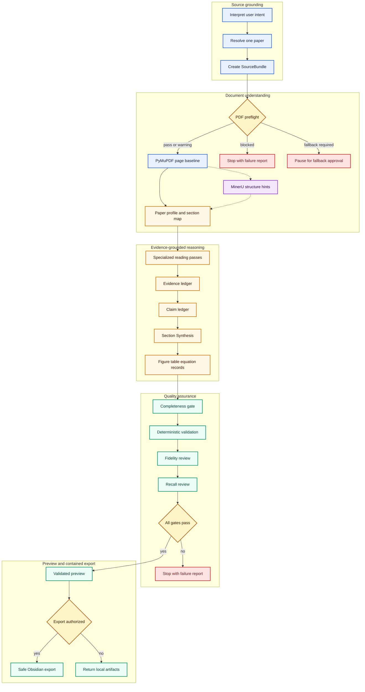

# Workflow

## State model



## Implemented autonomous path (v0.5 baseline, current v0.6 beta)

The bundled scripts and Skill implement this local autonomous path:

```text
Zotero Local API GET or manual PDF
→ one verified local PDF
→ PyMuPDF-authoritative physical-page baseline
→ consent-aware automatic MinerU whole-paper or page-subset route
→ private SourceBundle
→ paper profile, section map and six specialised reading passes
→ auto-extracted Evidence and auto-synthesized rich Claim ledgers
→ SectionSynthesis
→ all-figure inventory and 0–3 original-PDF key-figure crops
→ independent fidelity and recall reviews
→ required-content, depth, visual and evidence-quality gates
→ Paper Template - Final composition
→ deterministic page/quote/numeric/symbol/template checks
→ non-overwriting Markdown preview
→ hash-verified, path-contained, non-overwriting Obsidian export
```

- `scripts/zotero_local.py` restricts the base URL to loopback `/api`, sends only `GET`, requires one exact item and one PDF attachment, and then invokes the existing PDF preparation path.
- `scripts/litanchor_local.py` performs native-text preparation, validation and
  preview rendering for the manual path.
- `scripts/export_obsidian.py` requires a separately supplied authorized root and child Inbox, explicit confirmation, accepted warnings, an unchanged validated preview and zero target collisions.
- `scripts/pdf_figures.py` renders a verified figure and caption from the original PDF, refuses overwrite and records source/image hashes, physical page and crop geometry.
- `scripts/autonomous_deep_reading.py` reads a local three-mode upload-consent policy and automatically calls the token-free MinerU Flash service for eligible whole papers or page-preserving subsets. `scripts/mineru_adapter.py` enforces 10 MiB/20-page limits and records `exact`/`fuzzy`/`unmatched` alignment without promoting any block to formal evidence.
- `scripts/paper_quality_gate.py` blocks sparse or shallow deep ledgers and validates the canonical Final-template heading/slot contract.
- `scripts/autonomous_deep_reading.py` creates the PyMuPDF-authoritative page
  baseline, classifies the paper, materializes six reading-pass work packets,
  fuses aligned MinerU headings, enforces autonomous origins and requires
  separate fidelity/recall review contracts.
- `scripts/autonomous_semantic.py` materializes and validates EvidenceUnits,
  ClaimRecords, SectionSynthesis, visual analysis and independent review
  results before finalization.

PyMuPDF is the autonomous page/evidence authority; MinerU contributes aligned
structure candidates. Evidence selection, scientific content recall and
modality/scope review remain Agent reasoning responsibilities. Deterministic
gates reject known failure classes but do not replace comparison with human
annotations for scientific completeness.

After work-packet and MinerU fusion, the correct state is
`awaiting_agent_analysis`. No Final note may be composed while ledgers are
empty, visual analysis is pending or either independent review is incomplete.

## Stages and exit criteria

1. **Parse request.** Resolve `skim`, `deep`, or `internalize`; set `external_knowledge_allowed=false`; default to `deep` only for an explicit close-reading request.
2. **Resolve source.** Prefer one exact Item Key, citekey, DOI, or title match. Present ambiguous candidates instead of silently selecting the first result. Fall back to a user-provided PDF when Zotero access is unavailable.
3. **Build SourceBundle.** Preserve original metadata, the full author list, annotations, attachment key, PDF hash and acquisition method. Do not summarize during acquisition. Store only the first verified author in human-note frontmatter.
4. **Preflight PDF.** Check file validity, encryption, page count, text coverage, likely scanning, extraction corruption and layout warnings. Return `PASS`, `PASS_WITH_WARNINGS`, `FALLBACK_REQUIRED`, or `BLOCKED`.
5. **Extract by page.** Preserve PDF physical page boundaries, text blocks and warnings. Never flatten the entire paper into an unpaged string.
6. **Profile and map structure.** Distinguish empirical, method, model and review papers; map section boundaries without inventing missing sections.
7. **Run specialised reading passes.** Separately cover background/question/contribution; data/method/model/equation/metric/experiment; results/visuals; discussion/limits/conclusions; then compare the ledger with the detected paper structure.
8. **Build evidence ledger.** Extract the smallest sufficient original-language evidence units with page references, section, quote, numbers, units and epistemic markers.
9. **Run the Visual Selection Pass.** Every `deep`/`internalize` run must evaluate key visuals and select at most 1–3 objects that are indispensable to the method or main result. Crop from the original PDF, retain the manifest and verified Zotero page link, then pass edge/provenance checks. If none qualifies, record the reason. A failed or contaminated crop is rejected rather than embedded.
10. **Build rich claim ledger.** Generate intermediate knowledge objects only from evidence units; add explanatory detail, conditions, importance and Final-template section identity. Preserve scope, subject, causality and modality.
11. **Apply deep quality gate.** Require all core content groups, adequate claim/detail density and explanatory depth. Page dispersion alone is insufficient.
12. **Compose note.** Load `assets/Paper Template - Final.md` for `deep`/`internalize`; keep `skim` separate. Render only validated structured data.
13. **Validate.** Run deterministic checks, Final-template checks, independent
    fidelity review and paper-structure/content recall review. A blocker or
    error prevents formal export.
14. **Preview and export.** Show the note, warnings, failed pages and output paths. Write only to an explicitly authorized directory; never overwrite an existing note automatically.
15. **Record feedback.** Store feedback as a FeedbackEvent. Do not edit the formal Skill during a paper-reading run.

## Prompt-layer contracts

The implementation may use separate model calls, but each must emit structured output and obey the same closed-source rule.

| Stage prompt | Input | Output responsibility |
|---|---|---|
| Paper profile | page map and headings | paper type, section boundaries, confidence |
| Evidence extraction | one section/page batch | quoted evidence units only |
| Visual analysis | selected page render plus caption/body references | visual/equation record with parse status |
| Claim builder | evidence units | Chinese claims with modality and Evidence IDs |
| Note composer | validated ledgers and template | Markdown presentation only |
| Semantic reviewer | each claim and its evidence | support, numeric, scope, causality and modality verdicts |

Retries are object-scoped and limited to two attempts. After two failures, mark the object for human review.

## Evidence display

- General claims: show Evidence ID, PDF page and optional Zotero link inline.
- Core conclusions, key numbers, definitions and disputed wording: additionally show a collapsed Obsidian evidence callout.
- Repeated or long supporting excerpts: keep only in the evidence sidecar.
- Default quote limit: one sentence; use at most two when one sentence is insufficient.

## Failure semantics

- `原文未说明` means the information is absent from the paper.
- `不适用` means the field does not apply to this paper type.
- `本模式未生成` means the optional learning layer was not generated in `deep`; `internalize` must generate it.
- `待用户补充` means the field depends on the user's own research context.
- `解析失败` means the information may exist but could not be read reliably.

These states must never be substituted for one another.
