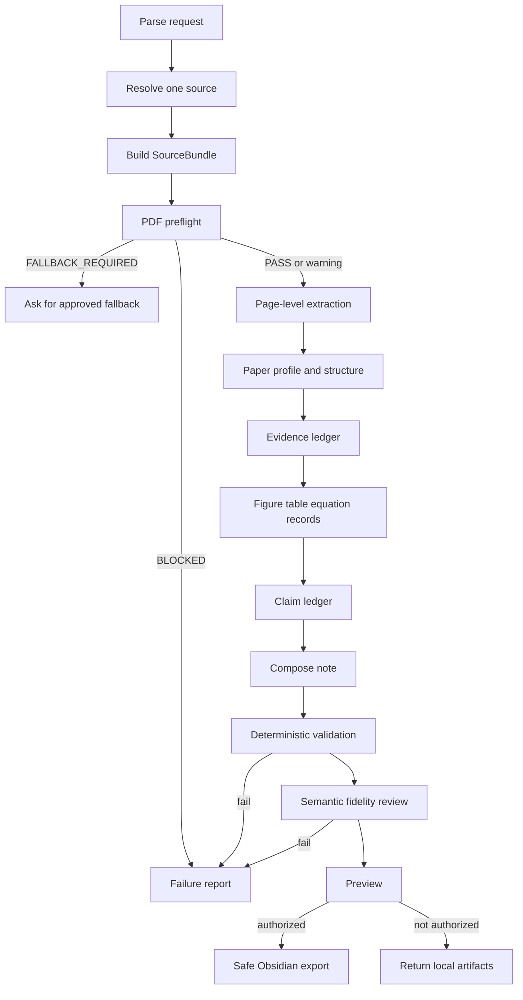

# Workflow

## State model



## Implemented local slice (v0.4)

Four deterministic scripts now implement the local integration path:

```text
Zotero Local API GET or manual PDF
→ one verified local PDF
→ physical-page preflight/extraction
→ optional original-PDF key-figure crop plus provenance manifest
→ private SourceBundle
→ Skill-generated Evidence/Claim ledgers
→ deterministic page/quote/numeric checks
→ non-overwriting Markdown preview
→ hash-verified, path-contained, non-overwriting test Inbox export
```

- `scripts/zotero_local.py` restricts the base URL to loopback `/api`, sends only `GET`, requires one exact item and one PDF attachment, and then invokes the existing PDF preparation path.
- `scripts/litanchor_local.py` performs native-text preparation, validation and preview rendering.
- `scripts/export_obsidian.py` requires a separately supplied authorized root and child Inbox, explicit confirmation, accepted warnings, an unchanged validated preview and zero target collisions.
- `scripts/pdf_figures.py` renders a verified figure and caption from the original PDF, refuses overwrite and records source/image hashes, physical page and crop geometry.

The slice deliberately stops before OCR or MinerU execution, Zotero writes, reverse Obsidian links and full semantic automation. MinerU remains an explicit-consent structure-enhancement design: its content must align back to PyMuPDF pages before use. Evidence selection and modality/scope review remain model responsibilities; the scripts verify their declared artifacts and never invent paper content.

## Stages and exit criteria

1. **Parse request.** Resolve `skim`, `deep`, or `internalize`; set `external_knowledge_allowed=false`; default to `deep` only for an explicit close-reading request.
2. **Resolve source.** Prefer one exact Item Key, citekey, DOI, or title match. Present ambiguous candidates instead of silently selecting the first result. Fall back to a user-provided PDF when Zotero access is unavailable.
3. **Build SourceBundle.** Preserve original metadata, the full author list, annotations, attachment key, PDF hash and acquisition method. Do not summarize during acquisition. Store only the first verified author in human-note frontmatter.
4. **Preflight PDF.** Check file validity, encryption, page count, text coverage, likely scanning, extraction corruption and layout warnings. Return `PASS`, `PASS_WITH_WARNINGS`, `FALLBACK_REQUIRED`, or `BLOCKED`.
5. **Extract by page.** Preserve PDF physical page boundaries, text blocks and warnings. Never flatten the entire paper into an unpaged string.
6. **Profile and map structure.** Distinguish empirical, method, model and review papers; map section boundaries without inventing missing sections.
7. **Build evidence ledger.** Extract the smallest sufficient original-language evidence units with page references, section, quote, numbers, units and epistemic markers.
8. **Inspect key visuals.** Process only figures, tables and equations that support core methods or results. Crop useful note figures from the original PDF, retain the image manifest and include a verified Zotero page link. If geometry, symbols or values cannot be read reliably, register the object as partial/failed and require original-page review.
9. **Build claim ledger.** Generate Chinese claims only from evidence units; preserve scope, subject, conditions, causality and modality. Every factual claim requires at least one Evidence ID.
10. **Compose note.** Render only validated structured data into the note template. Do not reinterpret the complete PDF at this stage.
11. **Validate.** Run deterministic checks first, then semantic fidelity review. A blocker or error prevents formal export.
12. **Preview and export.** Show the note, warnings, failed pages and output paths. Write only to an explicitly authorized directory; never overwrite an existing note automatically.
13. **Record feedback.** Store feedback as a FeedbackEvent. Do not edit the formal Skill during a paper-reading run.

## Prompt-layer contracts

The implementation may use separate model calls, but each must emit structured output and obey the same closed-source rule.

| Stage prompt | Input | Output responsibility |
|---|---|---|
| Paper profile | page map and headings | paper type, section boundaries, confidence |
| Evidence extraction | one section/page batch | quoted evidence units only |
| Visual analysis | selected page render plus caption/body references | visual/equation record with parse status |
| Claim builder | evidence units | Chinese claims with modality and Evidence IDs |
| Note composer | validated ledgers and template | Markdown presentation only |
| Semantic reviewer | each claim and its evidence | support, numeric, scope, causality and modality verdicts |

Retries are object-scoped and limited to two attempts. After two failures, mark the object for human review.

## Evidence display

- General claims: show Evidence ID, PDF page and optional Zotero link inline.
- Core conclusions, key numbers, definitions and disputed wording: additionally show a collapsed Obsidian evidence callout.
- Repeated or long supporting excerpts: keep only in the evidence sidecar.
- Default quote limit: one sentence; use at most two when one sentence is insufficient.

## Failure semantics

- `原文未说明` means the information is absent from the paper.
- `不适用` means the field does not apply to this paper type.
- `解析失败` means the information may exist but could not be read reliably.

These states must never be substituted for one another.
