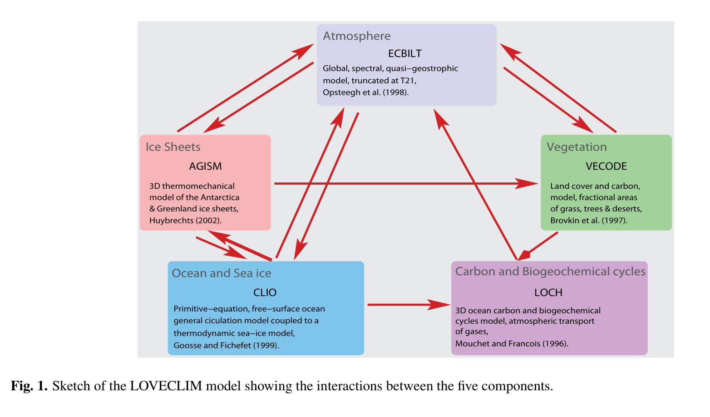
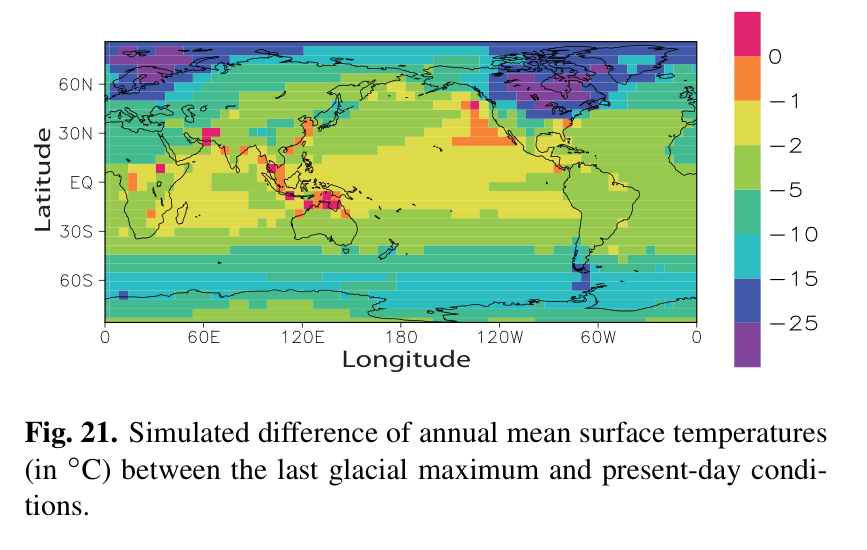

---
title: "Description of the earth system model of intermediate complexity LOVECLIM version 1.2"
authors: ["H. Goosse"]
year: 2010
journal: "Geoscientific Model Development"
doi: "10.5194/gmd-3-603-2010"
paper_type: ["model-description"]
keywords: []
zotero_key: "goosse2010DescriptionEarthSystem"
source_pdf: "item_key:4Y363LIR"
extraction_engine: "pypdf native text + PyMuPDF visual evidence"
review_status: "reviewed"
generation_mode: "human_assisted_regression"
autonomous_generation: false
tags: [literature-note, deep-reading, litanchor]
created: "2026-07-25T03:50:36+00:00"
---

# Description of the earth system model of intermediate complexity LOVECLIM version 1.2

<!--
LitAnchor Final template 1.0
- 只依据论文原文填写事实层。
- 论文事实缺失写“**原文未说明**”；论文类型不适用写“**不适用**”。
- deep 模式不生成的学习层写“**本模式未生成（仅 internalize 模式要求）**”。
- 用户个人判断写“**待用户补充**”；无法可靠读取写“**解析失败**”。
- 重要事实必须绑定 Evidence ID 与 PDF 物理页码。
- 以下 litanchor:user 区域由用户编辑，自动更新不得覆盖。
-->

> [!abstract] 一句话摘要
> 本文系统说明 LOVECLIM 1.2 的组成、组件耦合和关键参数，并用现代气候与多个古气候时段评估其性能和适用边界。 〔E-LC-M1, E-LC-Q1, E-LC-EVAL｜PDF p.1, p.3, p.18｜[打开 p.1](zotero://open-pdf/library/items/4QL76SLK?page=1)｜[打开 p.3](zotero://open-pdf/library/items/4QL76SLK?page=3)｜[打开 p.18](zotero://open-pdf/library/items/4QL76SLK?page=18)〕

## 1. 论文速览

> 本节只提供全文导读，每项控制在 1—3 句话；详细论证放在后续章节。

| 项目 | 内容 |
| --- | --- |
| 论文类型 | model-description |
| 研究对象 / 数据 / 模型 | LOVECLIM 1.2 耦合大气、海洋与海冰、陆面与植被、冰盖、冰山和碳循环等组成部分。 〔E-LC-M1｜PDF p.1｜[打开 p.1](zotero://open-pdf/library/items/4QL76SLK?page=1)〕 大气组件 ECBilt2 是 T21、3-level 的准地转模型，承担 LOVECLIM 中被重点简化的高计算成本部分。 〔E-LC-ATM｜PDF p.1｜[打开 p.1](zotero://open-pdf/library/items/4QL76SLK?page=1)〕 海洋组件 CLIO3 将海洋环流与热力—动力海冰模型耦合，水平分辨率为 3°×3°，海洋垂向设 20 层。 〔E-LC-OCEAN｜PDF p.1｜[打开 p.1](zotero://open-pdf/library/items/4QL76SLK?page=1)〕 |
| 核心问题 | 本文的任务是系统描述 LOVECLIM version 1.2 的现状，并提供简要性能评估与使用边界。 〔E-LC-Q1｜PDF p.3｜[打开 p.3](zotero://open-pdf/library/items/4QL76SLK?page=3)〕 |
| 方法路线 | CLIO 向 ECBilt 提供海表温度、海冰温度、各海洋网格的海冰比例以及海冰和积雪厚度。 〔E-LC-M3｜PDF p.16｜[打开 p.16](zotero://open-pdf/library/items/4QL76SLK?page=16)〕 大气组件 ECBilt2 是 T21、3-level 的准地转模型，承担 LOVECLIM 中被重点简化的高计算成本部分。 〔E-LC-ATM｜PDF p.1｜[打开 p.1](zotero://open-pdf/library/items/4QL76SLK?page=1)〕 海洋组件 CLIO3 将海洋环流与热力—动力海冰模型耦合，水平分辨率为 3°×3°，海洋垂向设 20 层。 〔E-LC-OCEAN｜PDF p.1｜[打开 p.1](zotero://open-pdf/library/items/4QL76SLK?page=1)〕 |
| 主要发现 | 在固定冰盖的理想化 CO2 加倍实验中，积分 1000 years 后地表温度升高 1.9°C；作者指出该敏感度位于 GCM 结果范围的低端。 〔E-LC-R1｜PDF p.18｜[打开 p.18](zotero://open-pdf/library/items/4QL76SLK?page=18)〕 模型能再现近几十年变暖趋势的增强，但显著低估变暖幅度。 〔E-LC-R2｜PDF p.22｜[打开 p.22](zotero://open-pdf/library/items/4QL76SLK?page=22)〕 末次盛冰期模拟总体与 PMIP2 其他模拟相似，但南大洋信号强于多数模型。 〔E-LC-R3｜PDF p.25｜[打开 p.25](zotero://open-pdf/library/items/4QL76SLK?page=25)〕 |
| 核心贡献 | 本文的主要文档性贡献是借 LOVECLIM 1.2 发布之机，给出当前模型状态的统一描述、简短性能评估以及面向用户的最新参考入口。 〔E-LC-Q1, E-LC-G1｜PDF p.3｜[打开 p.3](zotero://open-pdf/library/items/4QL76SLK?page=3)〕 |
| 关键限制 | 固定的陆海掩膜意味着模型无法显式表示海平面变化导致的海岸几何变化。 〔E-LC-L1｜PDF p.17｜[打开 p.17](zotero://open-pdf/library/items/4QL76SLK?page=17)〕 AGISM 耦合中的水量偏差约为南极径流的 10% 和格陵兰径流的 25%，因此需要热量与淡水通量调整以闭合收支。 〔E-LC-L2｜PDF p.18｜[打开 p.18](zotero://open-pdf/library/items/4QL76SLK?page=18)〕 最严重的系统偏差主要位于低纬：温度偏高、两半球降水分布过于对称，并高估副热带降水和植被覆盖。 〔E-LC-L3｜PDF p.1｜[打开 p.1](zotero://open-pdf/library/items/4QL76SLK?page=1)〕 |
| 论证主线 | 背景与缺口 → 研究问题 → 方法与证据 → 结果与解释 → 结论与边界 |

---

## 2. 背景、问题与贡献

### 2.1 研究背景与前人工作

- LOVECLIM 的设计取舍是降低空间分辨率并简化物理过程，以换取长积分和大集合实验所需的计算效率；在 2.5 Ghz 单 Xeon 上，约 4 h CPU time 可运行 100 years。 〔E-LC-M2｜PDF p.2｜[打开 p.2](zotero://open-pdf/library/items/4QL76SLK?page=2)〕
  - 较快运行速度使参数敏感性的大集合实验可负担。
  - 它也支持研究过去气候和长期未来气候变化所需的长模拟。
- 在本文发布前，ECBilt-CLIO、ECBilt-CLIO-VECODE 和 LOVECLIM 的不同版本已被用于 100 多篇论文，但这些信息分散在版本历史和多份文献中。 〔E-LC-PRIOR, E-LC-G1｜PDF p.3｜[打开 p.3](zotero://open-pdf/library/items/4QL76SLK?page=3)〕
  - 既有论文覆盖过程研究、古气候、现代变率和未来变化等任务。
  - 缺少统一版本说明会使新用户难以判断早期参数化是否仍适用。

### 2.2 研究缺口与研究问题

- 本文的任务是系统描述 LOVECLIM version 1.2 的现状，并提供简要性能评估与使用边界。 〔E-LC-Q1｜PDF p.3｜[打开 p.3](zotero://open-pdf/library/items/4QL76SLK?page=3)〕
  - 论文把模型当前状态、主要特征和简短性能评估作为同一描述任务。
  - 这一任务面向需要判断 LOVECLIM 是否适合特定分析的新用户。
- 此前缺少一份完整、最新的模型说明，用户必须追溯多年文献才能判断当前版本包含哪些过程。 〔E-LC-G1｜PDF p.3｜[打开 p.3](zotero://open-pdf/library/items/4QL76SLK?page=3)〕
  - 旧文献往往只说明新增组件或相对上一版本的主要差异。
  - 用户必须追溯长期代码历史，仍可能漏掉仅在内部报告中简短描述的过程。

### 2.3 贡献与创新

- 本文的主要文档性贡献是借 LOVECLIM 1.2 发布之机，给出当前模型状态的统一描述、简短性能评估以及面向用户的最新参考入口。 〔E-LC-Q1, E-LC-G1｜PDF p.3｜[打开 p.3](zotero://open-pdf/library/items/4QL76SLK?page=3)〕
  - 目标不是在一篇论文中列出全部方程和参数化细节。
  - 目标是让用户能够判断模型是否适合特定分析并识别相应限制。

---

## 3. 数据、材料与方法

### 3.1 研究对象、数据或材料

- LOVECLIM 1.2 耦合大气、海洋与海冰、陆面与植被、冰盖、冰山和碳循环等组成部分。 〔E-LC-M1｜PDF p.1｜[打开 p.1](zotero://open-pdf/library/items/4QL76SLK?page=1)〕
  - 大气由 ECBilt2 表示，海洋和海冰由 CLIO3 表示。
  - VECODE 处理陆面植被及陆地碳循环。
  - LOCH 表示海洋碳循环，AGISM 表示格陵兰和南极冰盖。

### 3.2 方法与研究设计

- CLIO 向 ECBilt 提供海表温度、海冰温度、各海洋网格的海冰比例以及海冰和积雪厚度。 〔E-LC-M3｜PDF p.16｜[打开 p.16](zotero://open-pdf/library/items/4QL76SLK?page=16)〕
  - 耦合信息同时包含海洋表面状态和海冰状态。
  - 海冰比例以每个 ocean grid cell 为单位传递。
  - 海冰厚度和积雪厚度分别保留。

#### 方法流程

1. CLIO 向 ECBilt 提供海表温度、海冰温度、各海洋网格的海冰比例以及海冰和积雪厚度。 〔E-LC-M3｜PDF p.16｜[打开 p.16](zotero://open-pdf/library/items/4QL76SLK?page=16)〕

### 3.3 关键模型、算法或技术环节

#### M1. 关键模型 1

- **作用与核心机制**：大气组件 ECBilt2 是 T21、3-level 的准地转模型，承担 LOVECLIM 中被重点简化的高计算成本部分。 〔E-LC-ATM｜PDF p.1｜[打开 p.1](zotero://open-pdf/library/items/4QL76SLK?page=1)〕
- ECBilt2 使用准地转动力框架。
- 大气简化是模型获得高运行速度的重要来源。
- **关键假设 / 条件**：原文未说明

#### M2. 关键模型 2

- **作用与核心机制**：海洋组件 CLIO3 将海洋环流与热力—动力海冰模型耦合，水平分辨率为 3°×3°，海洋垂向设 20 层。 〔E-LC-OCEAN｜PDF p.1｜[打开 p.1](zotero://open-pdf/library/items/4QL76SLK?page=1)〕
- CLIO3 包含 ocean general circulation model。
- 海冰部分同时描述热力过程和动力过程。
- **关键假设 / 条件**：原文未说明

#### M3. 关键模型 3

- **作用与核心机制**：VECODE 是 reduced-form 动态全球植被模型，用于模拟植被结构与陆地碳库从几十年到数千年尺度的变化。 〔E-LC-VECODE｜PDF p.8｜[打开 p.8](zotero://open-pdf/library/items/4QL76SLK?page=8)〕
- 该组件承担陆面植被与陆地碳循环。
- 其简化形式服务于长时段耦合模拟。
- **关键假设 / 条件**：粗分辨率大气模式的交互耦合与长期积分。

#### M4. 关键模型 4

- **作用与核心机制**：LOCH 表示海洋碳循环，并与 CLIO 共用网格和传输时间步，从而不需要额外插值。 〔E-LC-LOCH｜PDF p.17｜[打开 p.17](zotero://open-pdf/library/items/4QL76SLK?page=17)〕
- 溶质传输时间步与 CLIO 的 tracer transport 时间步一致。
- LOCH 与 CLIO 的共享网格简化了组件间交换。
- **关键假设 / 条件**：LOCH—CLIO 耦合运行。

#### M5. 关键模型 5

- **作用与核心机制**：AGISM 由分别面向南极与格陵兰冰盖的两个三维热力—力学冰动力模型组成。 〔E-LC-AGISM｜PDF p.12｜[打开 p.12](zotero://open-pdf/library/items/4QL76SLK?page=12)〕
- 南极组件包含耦合冰架和 grounding-line dynamics。
- 格陵兰组件不包含冰架动力。
- **关键假设 / 条件**：南极与格陵兰冰盖分别计算。

#### M6. 关键模型 6

- **作用与核心机制**：冰山模块是 LOVECLIM 的可选组件，但未用于本文第 3 节讨论的实验。 〔E-LC-ICEBERG｜PDF p.15｜[打开 p.15](zotero://open-pdf/library/items/4QL76SLK?page=15)〕
- 组件说明与本次实验实际启用范围必须分开记录。
- 不能因为代码中存在该模块就声称本文实验使用了它。
- **关键假设 / 条件**：optional；本文 Section 3 实验未启用。

### 3.4 核心公式与评价指标

#### Metric 1：计算效率

- **用途与定义**：在 2.5 Ghz 单 Xeon 处理器上，所有组件启用时约 4 h CPU time 可模拟 100 years，这使长时段和大集合实验可行。 〔E-LC-M2｜PDF p.2｜[打开 p.2](zotero://open-pdf/library/items/4QL76SLK?page=2)〕
- 该速度允许开展参数选择影响的大集合试验。
- 也允许进行研究古气候和长期变化所需的长时段积分。
- **成立条件、单位或适用限制**：单个 2.5 GHz Xeon 处理器、全部组件启用。

### 3.5 实验、比较与复现要点

| 实验 / 比较 | 设置、目的与关键结果 | 证据位置 |
| --- | --- | --- |
| 实验 | 性能评估依次检查现代平均态和 4 个关键时期：最近几十年、过去一千年、中全新世（6 ky BP）与末次盛冰期。；现代平均态用于定位变量和区域偏差。；古气候时期用于比较模型在不同强迫背景下的响应。 | 〔E-LC-EVAL｜PDF p.18｜[打开 p.18](zotero://open-pdf/library/items/4QL76SLK?page=18)〕 |

---

## 4. 核心结果与证据

> 每条只记录一个可独立核验的核心结果。推测不写成“结果”，应放入第 6 节。

### R1. 核心结果 1

- **主要发现**：在固定冰盖的理想化 CO2 加倍实验中，积分 1000 years 后地表温度升高 1.9°C；作者指出该敏感度位于 GCM 结果范围的低端。 〔E-LC-R1｜PDF p.18｜[打开 p.18](zotero://open-pdf/library/items/4QL76SLK?page=18)〕
- **论证与细节**：
  - 该实验把 CO2 浓度相对工业前水平加倍。
  - 冰盖在这一理想化试验中保持固定。
  - 作者把这一响应作为模型气候敏感度的估计，并指出它处于 GCM 结果范围低端。
- **关键数值、比较或不确定性**：integration time 1000 years（doubled CO2, fixed ice sheets）；surface temperature increase 1.9 ◦C（doubled CO2）
- **证据状态**：作者报告
- **成立条件与适用范围**：原文未说明

### R2. 核心结果 2

- **主要发现**：模型能再现近几十年变暖趋势的增强，但显著低估变暖幅度。 〔E-LC-R2｜PDF p.22｜[打开 p.22](zotero://open-pdf/library/items/4QL76SLK?page=22)〕
- **论证与细节**：
  - 模型成功再现的是最近几十年变暖趋势的增强。
  - 但模拟变暖的幅度显著偏小。
  - 因此趋势方向和响应幅度必须分别评价，不能合并成“再现良好”。
- **关键数值、比较或不确定性**：原文未说明
- **证据状态**：作者报告
- **成立条件与适用范围**：原文未说明

### R3. 核心结果 3

- **主要发现**：末次盛冰期模拟总体与 PMIP2 其他模拟相似，但南大洋信号强于多数模型。 〔E-LC-R3｜PDF p.25｜[打开 p.25](zotero://open-pdf/library/items/4QL76SLK?page=25)〕
- **论证与细节**：
  - 这一结果是 Figure 21 被选为核心结果图的直接依据。
  - 相似性具有区域边界，不能推广为所有区域完全一致。
- **关键数值、比较或不确定性**：原文未说明
- **证据状态**：作者报告
- **成立条件与适用范围**：原文未说明

### R4. 核心结果 4

- **主要发现**：LOVECLIM 1.2 能较好再现现代气候以及过去一千年、中全新世和末次盛冰期的主要特征，但这不意味着各区域和变量都同等可靠。 〔E-LC-PERF, E-LC-L3｜PDF p.1｜[打开 p.1](zotero://open-pdf/library/items/4QL76SLK?page=1)〕
- **论证与细节**：
  - 总体时期特征的再现与低纬显著偏差可以同时存在。
  - 因此笔记必须把总体性能判断与区域限制并列呈现。
- **关键数值、比较或不确定性**：model version 1.2（LOVECLIM）
- **证据状态**：作者报告
- **成立条件与适用范围**：原文未说明

---

## 5. 重要图表

| 图表编号 | 回答什么问题 | 主要信息 | 支撑结果 | 页码 | 核验状态 |
| --- | --- | --- | --- | --- | --- |
| Figure 1 | 该图概括 LOVECLIM 五个组成模块及其耦合关系，是理解整篇模型描述的总览示意图。 | Fig. 1. Sketch of the LOVECLIM model showing the interactions between the five components. | 核心方法图 | [PDF p.2](zotero://open-pdf/library/items/4QL76SLK?page=2) | 已查看原 PDF 裁图 |
| Figure 21 | 该图展示末次盛冰期与现代地表温度差异，是模型古气候适用性与区域偏差讨论的核心结果图。 | Fig. 21. Simulated difference of annual mean surface temperatures (in ◦C) between the last glacial maximum and present-day conditions. | 核心结果图 | [PDF p.25](zotero://open-pdf/library/items/4QL76SLK?page=25) | 已查看原 PDF 裁图 |

### Figure 1

- **选择理由**：该图概括 LOVECLIM 五个组成模块及其耦合关系，是理解整篇模型描述的总览示意图。
- **完整图题**：Fig. 1. Sketch of the LOVECLIM model showing the interactions between the five components.
- **正文讨论位置**：PDF p.2，Introduction
- **读图注意事项**：原文未说明
- [在 Zotero 打开原页](zotero://open-pdf/library/items/4QL76SLK?page=2)

### Figure 21

- **选择理由**：该图展示末次盛冰期与现代地表温度差异，是模型古气候适用性与区域偏差讨论的核心结果图。
- **完整图题**：Fig. 21. Simulated difference of annual mean surface temperatures (in ◦C) between the last glacial maximum and present-day conditions.
- **正文讨论位置**：PDF p.25，Section 3.5
- **读图注意事项**：原文未说明
- [在 Zotero 打开原页](zotero://open-pdf/library/items/4QL76SLK?page=25)

---

## 6. 讨论、结论与限制

### 6.1 作者如何解释结果

- 末次盛冰期结果整体与 PMIP2 其他模拟相似，但南大洋信号比多数模型更强；该一致性并非在所有区域成立。 〔E-LC-R3｜PDF p.25｜[打开 p.25](zotero://open-pdf/library/items/4QL76SLK?page=25)〕
  - 与 PMIP2 多模型的一致性是区域依赖的。
  - 南大洋是本文明确指出的偏离区域。
  - 该比较支持模型用于 LGM 研究，但不支持宣称所有区域响应都一致。
- 作者明确提醒：作为中等复杂度模型，LOVECLIM 不应被期待以与 GCM 相同的技巧和细节再现所有观测；评价应结合它的计算效率和结构性简化。 〔E-LC-DISC, E-LC-M2｜PDF p.2, p.18｜[打开 p.2](zotero://open-pdf/library/items/4QL76SLK?page=2)｜[打开 p.18](zotero://open-pdf/library/items/4QL76SLK?page=18)〕
  - 某些偏差直接来自基本模型假设。
  - 若为减小偏差而改变这些假设，可能牺牲 LOVECLIM 的主要优势。

### 6.2 核心结论

- 作者认为 LOVECLIM 更适合研究中高纬长期气候变化和需要大集合的研究；低纬强偏差区必须特别谨慎解释。 〔E-LC-C1, E-LC-L3, E-LC-M2｜PDF p.1, p.2, p.26｜[打开 p.1](zotero://open-pdf/library/items/4QL76SLK?page=1)｜[打开 p.2](zotero://open-pdf/library/items/4QL76SLK?page=2)｜[打开 p.26](zotero://open-pdf/library/items/4QL76SLK?page=26)〕
  - 中高纬长期气候变化是作者明确给出的主要适用方向。
  - 低纬强偏差区需要针对偏差如何影响研究结论进行专门分析。
  - 较低计算成本使需要大集合的研究成为另一类适用场景。

### 6.3 局限性与不确定性

- 固定的陆海掩膜意味着模型无法显式表示海平面变化导致的海岸几何变化。 〔E-LC-L1｜PDF p.17｜[打开 p.17](zotero://open-pdf/library/items/4QL76SLK?page=17)〕
  - 限制来自固定陆海掩膜。
  - 因此海平面变化引起的海岸线移动不能在模型中显式更新。
- AGISM 耦合中的水量偏差约为南极径流的 10% 和格陵兰径流的 25%，因此需要热量与淡水通量调整以闭合收支。 〔E-LC-L2｜PDF p.18｜[打开 p.18](zotero://open-pdf/library/items/4QL76SLK?page=18)〕
  - 偏差分别相对于南极和格陵兰总径流给出。
  - 耦合系统需要通过附加淡水与潜热通量实现热量和水量收支闭合。
- 最严重的系统偏差主要位于低纬：温度偏高、两半球降水分布过于对称，并高估副热带降水和植被覆盖。 〔E-LC-L3｜PDF p.1｜[打开 p.1](zotero://open-pdf/library/items/4QL76SLK?page=1)〕
  - 低纬地表温度被高估。
  - 降水在南北半球之间分布得过于对称。
  - 副热带降水和植被覆盖均被高估。

---

## 7. 对研究与学习的价值

> [!warning] 以下属于学习启发，不是作者原文结论。

### 7.1 与我的研究的关系

**待用户补充**

<!-- litanchor:user:start -->
- **我的补充**：
<!-- litanchor:user:end -->

### 7.2 125 提炼

#### 1 个可继续发展的思路

**本模式未生成（仅 internalize 模式要求）**

#### 2 个值得模仿的图表

1. **Figure 1**：该图概括 LOVECLIM 五个组成模块及其耦合关系，是理解整篇模型描述的总览示意图。
2. **Figure 21**：该图展示末次盛冰期与现代地表温度差异，是模型古气候适用性与区域偏差讨论的核心结果图。

#### 5 个值得学习的英文表达

**本模式未生成（仅 internalize 模式要求）**

---

## 8. 术语、原文证据与滚雪球阅读

### 8.1 术语与待解决问题

**本模式未生成（仅 internalize 模式要求）**

### 8.2 关键原文证据与可引用内容

> 只收录支撑核心结论、方法或研究缺口的关键原文；原文必须逐字复制。

| ID | 原文 | 页码 / 章节 | 支撑内容 |
| --- | --- | --- | --- |
| E-LC-Q1 | We take here the opportunity of the release of LOVECLIM1.2 to describe in more detail the present state of the model. | PDF p.3 / Introduction | C-LC-Q1, C-LC-CONTRIB |
| E-LC-G1 | However, no full description of the model is currently available. | PDF p.3 / Introduction | C-LC-G1, C-LC-CONTRIB |
| E-LC-M2 | On one single Xeon processor (2.5 Ghz), it is possible to run 100 years, with all the components activated, in about 4 h of CPU time. | PDF p.2 / Introduction | C-LC-C1 |
| E-LC-M3 | CLIO provides ECBilt with the sea surface temperature, the sea-ice temperature, the fraction of sea ice in each ocean grid cell and the sea-ice and snow thicknesses (in order to compute the snow and sea-ice albedo in ECBilt). | PDF p.16 / Coupling the Different Components | C-LC-M3 |
| E-LC-L1 | As a consequence, any change in coastal geometry, for instance implied by a sea level rise, cannot be taken into account explicitly in the model. | PDF p.17 / Coupling the Different Components | C-LC-L1 |
| E-LC-L2 | Biases are of the order of 10% to 25% of the total runoff from Antarctica and Greenland, respectively. | PDF p.18 / Coupling the Different Components | C-LC-L2 |
| E-LC-R1 | They are not described here but it is useful to mention that when the CO2 concentration is doubled compared to pre-industrial conditions, the surface temperature increases by 1.9 ◦C after 1000 years of integration in LOVECLIM (with fixed ice sheets), giving an estimate of the model climate sensitivity. | PDF p.18 / Evaluation of Model Performance | C-LC-R1 |
| E-LC-R2 | The model is also able to reproduce the observed intensification of the warming trend over the last decades (Table 7). However, the model significantly underestimates the magnitude of this warming. | PDF p.22 / The Last Decades | C-LC-R2 |
| E-LC-R3 | Those results are similar to the ones of other simulations performed in the framework of the PMIP2 project (Braconnot et al., 2007), except in the Southern Ocean where the signal obtained in LOVECLIM is larger than the one given by most other models. | PDF p.25 / The Last Glacial Maximum | C-LC-R3 |
| E-LC-L3 | The most serious ones are mainly located at low latitudes with an overestimation of the temperature there, a too symmetric distribution of precipitation between the two hemispheres, and an overestimation of precipitation and vegetation cover in the subtropics. | PDF p.1 / Abstract | C-LC-L3, C-LC-C1, C-LC-PERF |
| E-LC-C1 | The discussion of model results underlines that the model appears well adapted to study long-term climate changes, in particular at mid- and high- latitudes. | PDF p.26 / Summary and Conclusions | C-LC-C1 |
| E-LC-ATM | The atmospheric component is ECBilt2, a T21, 3-level quasi-geostrophic model. | PDF p.1 / Abstract | C-LC-ATM |
| E-LC-OCEAN | The ocean component is CLIO3, which consists of an ocean general circulation model coupled to a comprehensive thermodynamic-dynamic sea-ice model. Its horizontal resolution is of 3 ◦ by 3 ◦, and there are 20 levels in the ocean. | PDF p.1 / Abstract | C-LC-OCEAN |
| E-LC-EVAL | In the following sections, we will thus describe briefly the mean state of the model for present-day conditions and then discuss the model behaviour for 4 key periods: the last decades, the last millennium, the mid-Holocene (6 ky BP) and the Last Glacial Maximum (LGM, 21 ky BP). | PDF p.18 / Evaluation of Model Performance | C-LC-EVAL |
| E-LC-PERF | LOVECLIM1.2 reproduces well the major characteristics of the observed climate both for present-day conditions and for key past periods such as the last millennium, the mid-Holocene and the Last Glacial Maximum. | PDF p.1 / Abstract | C-LC-PERF |
| E-LC-VECODE | It is a reduced-form dynamic global vegetation model (DGVM), which simulates changes in vegetation structure and terrestrial carbon pools on timescales ranging from decades to millennia. | PDF p.8 / VECODE: the continental biosphere component | C-LC-VECODE |

### 8.3 值得继续追踪的参考文献

**本模式未生成（仅 internalize 模式要求）**

<!-- litanchor:validation template=paper-template-final@1.0; run=20260724T114928Z-c4738e934224; evidence=25; claims=26; status=completed_with_warnings; pdf_sha256=c4738e93422406111a9fdb108fb0265d6580d77901654648ca0997d88a11c02d -->
